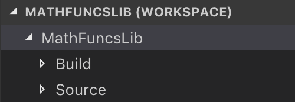

###### Walkthrough: Using C/C++ with Xamarin

# Introduction 
Xamarin enables developers to create cross-platform native mobile apps from a single IDE (Integrated Development Environment), namely Visual Studio, using C# as the common programming language. The expected benefits include faster time-to-market and lower maintenance cost without sacrificing the native experience.   

Existing platform components, such as those written in the languages and tools native to those platforms, can be brought to bear via bindings. However, there are situations where Xamarin apps need to work with existing codebases written in C/C++, such as when porting a large well-tested and highly optimized codebase to C# is cost prohibitive, or there is insufficient time and/or lack of available skills in order to do so. 

Microsoft has used C/C++ and Xamarin to deliver apps such as [Hyperlapse Mobile](https://www.microsoft.com/p/hyperlapse-mobile/9wzdncrd1prw?from=http%3a%2f%2fresearch.microsoft.com%2fum%2fredmond%2fprojects%2fhyperlapseapps%2f&activetab=pivot:overviewtab) and [Pix Camera](https://www.microsoft.com/microsoftpix) in order to leverage investments in an existing C/C++ codebase whilst maximizing code sharing from a client application perspective. Tools such as [Visual C++ for cross-platform mobile development](https://docs.microsoft.com/visualstudio/cross-platform/visual-cpp-for-cross-platform-mobile-development) enable the C/C++ and C# code to be built as part of the same solution offering many advantages including a unified debugging experience.  

However, in some cases there is a strong desire (or requirement) to keep existing native tools and processes in place as well as keeping the library (and its release schedule) decoupled from the application itself. In these situations, the focus is not only on how to expose the relevant members to C# but on managing that library as a dependency. And of course, automating as much of this process as possible.    

The goal of this document is to outline a high-level approach for addressing this scenario before walking through a simple example.   

# Background
C/C++ is considered a cross-platform language on the basis that the same source code can be compiled for every major mobile platform using the compiler provided by each respective vendor. However, great care must be taken to ensure that the source code is indeed cross-platform. That is, it uses standard C/C++ (supported by all target compilers) containing no platform or compiler specific code. Code can of course be included conditionally, however it is ideal to avoid this if possible to reduce complexity. 

In situations where the codebase has been written for a specific platform, additional work will likely be required in order to replace platform-specific headers, APIs and type definitions with their cross-platform counterparts. For example, code written with Windows may have platform-specific types such as DWORD which would need changing to use the standard 'C' type (a [32-bit unsigned integer](https://msdn.microsoft.com/library/cc230318.aspx) known as an [unsigned long](https://en.cppreference.com/w/cpp/language/types)) in order to make it cross-platform compatible.  

Enforcing standards compliance through the various compiler options and through the removal of any platform-specific headers will no doubt result in lots of compiler errors. Resolving these can be a very frustrating process involving lots of web searches and iteration.  

Ultimately the code must compile and run successfully on all target platforms therefore this boils down to the commonality across all platforms (and compilers) being targeted. Issues may still arise from minor differences between compilers and so thorough testing (preferably automated) on each target platform becomes increasingly important. 

## Key Concepts and Terminology
Let's cover off some important terminology and concepts before moving on. If you're already familiar with terms such as toolchain, name mangling and so on, then please feel free to skip right to the [high-level approach](#high-level-approach) that provides the basis for this walkthrough.    

**IDEs (Integrated Development Environment) and toolchains**  
An IDE can be thought of as a single tool from which all development tasks can be performed such as code authoring, compiling, linking, deploying, debugging, executing tests and so on. It could be considered an orchestrator of multiple unrelated tools reducing the need to manually configure the individual components involved in the process, otherwise known as a toolchain. It is actually common to use an IDE of choice (such as [Microsoft Visual Studio](https://visualstudio.microsoft.com)) to perform code authoring along with local debugging and testing but have a separate automated build and release process managed via build scripts or a make file.   

**Compiling and Linking**  
Compilation is the process of translating source code files into object files where an object file is created for each source file typically output using the same name. Linking subsequently turns the individual object files into a single library or executable. In many cases, this also involves linking with other libraries outside of the source code. Cross compilers, such as [GCC](https://gcc.gnu.org), enable the separation between a given build environment and the target platform allowing us to compile our common code for multiple platforms from a single build agent. However, we would require separate build agents to build libraries or executables that target both iOS and Windows. For example we can compile apps and libraries for Android from a Mac or Windows workstation, however certain iOS and Windows toolchain components are proprietary and can be executed on those respective environments only so we require separate build agents in order to build libraries or executables that target both iOS and Windows.  

**Target Architectures**  
The term 'target architecture' is principally the CPU (and Operating System) for which the machine code is intended to run on. Code compiled on Windows for x86_64 will not work on the iOS simulator simply because they share the same CPU architecture. Platform vendors provide their own compilers, command-line utilities, symbolic links (a.k.a. soft links) and other configurations required to build for each supported target. These are often command-line compatible with cross compilers such as [GCC](https://gcc.gnu.org). For example, if you run *g++ --version* from Terminal, then assuming you have Xcode and the command-line tools installed, it will indicate that it has been configured to use the Xcode toolchain by default. You can also browse to the [Android NDK directory](https://docs.microsoft.com/xamarin/android/troubleshooting/questions/android-sdk-location?tabs=macos) to find the analogous Android toolchain components.  

**Static vs. Dynamic Libraries**  
Libraries are often used to encapsulate a set of related functionality enabling sharing and distribution of code across multiple external libraries or executables in a modular fashion. A static library is resolved at compile-time and ultimately becomes part of the resulting consuming library or executable. A dynamic library is resolved at runtime by being copied into memory and bound to the respective process although the exact behaviour is platform-specific. Both of these approaches have their advantages and disadvantages along with implementation nuisances. It is often a case of choosing the most appropriate option given the situation and so further reading is certainly beneficial if you are unfamilier with this concept. An important consideration is that Apple do not support the [use of dynamic libraries that are not packaged as a framework](https://developer.apple.com/library/archive/technotes/tn2435/_index.html#//apple_ref/doc/uid/DTS40017543-CH1-TROUBLESHOOTING). Use of dynamic libraries is technically possible but apps that follow this approach will be rejected when they are submitted to the public App Store.    

**Name Mangling and Extern C**  
In order to ensure function, variable and type names are unique within a given namespace, C++ encodes them during compilation in a process referred to as name mangling. This behaviour makes it more challenging to consume the library in scenarios such as ours. Whilst it is possible to determine the generated names using tools such as nm (included with Xcode Command Line Tools) or [dumpbin](https://msdn.microsoft.com/library/b06ww5dd.aspx) (for Windows), this is not ideal since the generated names might change depending on the compiler being used and when things invariably change in our code. The solution in this case is to prevent this by applying the *extern "C"* linkage specifier to the respective declarations. This can be done explicitly for each declaration or for multiple declarations using a block.  

**CMAKE**  
CMAKE is an open-source software tool for managing the build process in a platform (and Operating System) agnostic manner. It can support multiple builds from the same source code using a single configuration. The tool does not compile anything itself, but rather helps to orchestrate the process and with creating the build environment required for each target. 

**P/Invoke**  
P/Invoke (short for platform invoke) is a feature of the CLI that enables .NET code to call unmanaged code. This is done by associating the DllImport attribute with a given managed method (that is marked as external), specifying the library to be loaded into the process memory and optionally the entry point depending upon the calling convention being used. That is, it will use the name of the managed method to lookup and resolve the function if no explicit entry point is specified. The DllImport attribute has other parameters to denote how the underlying method signature is defined and resolved, however this is sufficient background at this time.  

**Marshalling**  
This is the process in which method arguments and return values are transformed into a suitable format so they can be passed between managed and unmanaged memory. Where data types have common representations in both managed and unmanaged memory the marshalling service is able to handle the conversion of those types automatically. It is possible to specify explicitly how the a given type should be marshalled such as when a type does not have a common or unambiguous representation. Marshalling and unmarshalling has been compared to how serialization and deserialization works for example converting a given object into a common string format that can then be used to create a new object from that state. 

# High-level Approach
The illustration below represents the high-level approach we'll be using in the walkthrough in order to transform some basic C/C++ source code into a cross-platform Xamarin library we can share via NuGet and consume in a Xamarin.Forms app just as we would any other C# based library.  


This process is comprised of 4 stages:

1. Compiling the C/C++ source code into platform-specific native libraries
2. Creating the Visual Studio solution for wrapping the native libraries 
3. Packing and pushing a NuGet package for the .NET wrapper
4. Consuming the NuGet package from a Xamarin app

## Compiling the C/C++ source code into platform-specific native libraries
The ultimate goal of this stage is to output the native libraries so that they can be used by the C# callable wrapper. This involves orchestrating the appropriate toolchains for each platform to create the binaries for each target architecture. For simplicity, we'll target a subset of architectures only. For iOS, we can then use the lipo utility to create a single fat binary from the individual architecture-specific binaries. In this walkthrough we'll be using dynamic libraries for Android and a static library for iOS. The resulting binaries will have a .so extension for Android and .a for iOS.  

We will be writing the C/C++ code using Visual Studio Code as our code editor of choice and will create a basic shell script for handling our build process. The idea is to stay unopinionated about this part of the flow and to keep everything as first-principles as possible whilst bringing to life some of the key concepts. Our primary focus is on the latter stages as this initial part of the process is well-established and separate teams have their own tools and processes of choice in our scenario. 

In any case, the following tools are worth considering:  

**[SWIG (Simplified Wrapper and Interface Generator)](https://www.swig.org)**  
Open-source tool for parsing C/C++ interfaces to generate wrappers making it easier to invoke from a CLI application using languages such as C#. 

**[Visual C++ for cross-platform mobile development](https://docs.microsoft.com/visualstudio/cross-platform/visual-cpp-for-cross-platform-mobile-development)**  
Installable option for Visual Studio 2017 enabling the authoring, unified debugging and testing of C++ using Visual Studio for building cross-platform (Android, iOS, Windows) mobile apps and libraries. This is relatively straight forward to set up and handles the orchestration of the underlying native toolchains. At time of writing, the tools (and build) can be used on Windows only using a paired build agent to handle the iOS steps. A great option for those familiar with Visual Studio and its rich features even when used in a standalone capacity separate to the Xamarin solution.  

The key takeaway here is that there is no perfect solution, only approaches. Key considerations include keeping the C/C++ codebase in sync with any native wrapper code (if this is maintained in separate codebases and/or by separate teams) and ensuring there is sufficient unit testing in place. Having as much of this process automated (and documented) is also ideal. 

## Creating the Visual Studio solution for wrapping the native libraries
At this stage we will create a wrapper that facilitates the use of the respective native libraries in .NET. More specifically, we'll be creating a Visual Studio solution with 4 projects. A shared project containing all our common code, targets for Xamarin.Android and Xamarin.iOS and a .NET Standard target which will enable the our library to be referenced in the shared code in a platform-agnostic manner.   

We're going to use a technique called 'bait and switch'. This is not a prerequisite, however at a high-level it will simplify how our library is referenced and avoid the need to explicitly manage platform-specific implementations within the consuming application itself. This approach is described in greater detail in a blog post by Paul Betts called [the bait and switch trick](https://log.paulbetts.org/the-bait-and-switch-pcl-trick/). However, for the purposes of the walkthrough, this will essentially involve ensuring that our targets (.NET Standard, Android, iOS) share the same namespace, assembly name and class structure. Since a platform-specific library is preferred, the .NET Standard version is never used in practice at runtime. If you're not familiar with this technique, hopefully it'll all make sense once we start implementing it.   

Most of the work in this step will focus on using P/Invoke to call our native library methods and managing the references to the underlying objects. Our goal is to expose this functionality to the consumer whilst abstracting out any complexity or the need to have working knowledge on the inner workings of our unmanaged library. It should feel like they are using any other managed C# library.  

Ultimately, the required output is a set of .NET libraries, one per target, along with a nuspec document that contains the information required in order to build our package in the next step.

Having a good set of unit tests for the wrapper is also good idea.  

## Packing and pushing a NuGet package for the .NET wrapper  
Next we will create our NuGet package using the build artefacts from the previous step. For the purposes of this walkthrough, we will create a local directory to serve as our NuGet feed as this will help us to keep the focus on how the package is created and consumed and how the bait and switch approach manifests itself in practice. In reality, this step would be fully automated and would result in a package being published to either a public or private NuGet feed.  

The outcome from this step is having a NuGet package that we can consume from a Xamarin app.  

## Consuming the NuGet package from a Xamarin.Forms app
For the final step we will need to configure Visual Studio for Mac to use our local directory as a NuGet feed. Once this is configured, we will create a new Xamarin.Forms app and add a reference to our package for each project. In this case, we are able to write all our code in a single place and should be able to call our native library functionality in a cross-platform manner.

I'll provide some references to documentation addressing how to setup a private NuGet feed on Azure DevOps and how to push our package to that feed. You can then choose to add that private feed to Visual Studio and update the project references to use that instead of the local directory.

# Walkthrough
This walkthrough is structured based on the [high-level approach](#high-level-approach) described previously. 

#### Prerequisites
In order to follow along, you will need:
- [Android NDK](https://developer.android.com/ndk/downloads/)
- [Command Line Tools for Xcode](https://developer.apple.com/download/more/)
- [NuGet Command Line (CLI)](https://docs.microsoft.com/nuget/tools/nuget-exe-cli-reference#macoslinux)
- [Microsoft C/C++ Extension (for VS Code)](https://marketplace.visualstudio.com/items?itemName=ms-vscode.cpptools)
- [Visual Studio Code](https://code.visualstudio.com) 
- [Visual Studio for Mac](https://visualstudio.microsoft.com/vs/mac/)

The steps in this first-principles walkthrough are relatively simple, and it should be possible to follow along without prior experience. However, familiarity with the following concepts will be beneficial:  

- [C#](https://docs.microsoft.com/dotnet/csharp/) and [C/C++](http://www.cplusplus.com) languages
- Familiarity with basic [Shell scripting](https://developer.apple.com/library/archive/documentation/OpenSource/Conceptual/ShellScripting/shell_scripts/shell_scripts.html) concepts
- Using [compiler toolchains for C/C++]((http://www.cplusplus.com/doc/tutorial/introduction/)) via command line  
- Developing Android and iOS apps with [Visual Studio for Mac](https://visualstudio.microsoft.com/vs/mac/) using [Xamarin](https://visualstudio.microsoft.com/xamarin/)

**NOTE:** You must have an active [Apple Developer Account](https://developer.apple.com) in order to download the - [Command Line Tools for Xcode](https://developer.apple.com/download/more/) and deploy apps to an iPhone.   

## Creating the native library
I have used the *MathFuncsLib* example from [Walkthrough: Creating and Using a Static Library (C++)](https://docs.microsoft.com/cpp/windows/walkthrough-creating-and-using-a-static-library-cpp?view=vs-2017) as the basis for our native library functionality. The intent was to keep the C/C++ code simple with the focus being on the subsequent steps for wrapping, distributing, and consuming our library in a Xamarin.Forms app.  

Depending on your background and experience, it may take some time to follow this part of the walkthrough end-to-end. You can always skip ahead to the [next step: wrapping the native library](#wrapping-the-native-library) using the [precompiled libraries](https://github.com/xamarin/mobcat/blob/master/samples/cpp_with_xamarin/Sample/Artefacts/PrecompiledLibs.zip) and return to complete this part at a more convenient time.  

You will require **Visual Studio for Mac** in order to follow along with the first part of this walkthrough. You can use **Visual Studio 2017** (on **Windows**) for the subsequent steps if you prefer however the walkthrough steps will be specific to **Visual Studio for Mac**. 

### Creating a workspace
1. In **Finder**, create a folder to use as your workspace. For example, *'~/MathFuncsLib'* 
2. In **VS Code**, click **Add workspace folder** from the **Welcome** options under the **Start** heading
3. Select your folder in **Finder**, then Click **Add**
4. Select **Save Workspace As** from the **File** menu and set the workspace folder you created as the chosen destination in **Finder**
5. Use the **MathFuncsLib** as the workspace name then choose **Save**
6. In the **Explorer** view, **CONTROL + CLICK** on the **MathFunsLib** folder, then choose **Add Folder** naming it *'Build'*
7. Repeat step 6 to create another subfolder called *'Source'*
8. Validate that your workspace folder structure (in the **Explorer** view) appears as illustrated below

    

### Configuring a build task
At this stage, we have a bare-bones workspace we can start adding files to. While we will be orchestrating the build via a shell script, it would be more convenient to be able to run that from within the VS Code editor using the standard **CMD + SHIFT + B** build shortcut. If you try this now, you'll be prompted to select the build task to run. We will configure a default for this command now by creating a *tasks.json* file for the workspace.  

1. Open the **Command Palette** using **SHIFT + CMD + P** (View > Command Palette)
2. Search for and choose the **Tasks: Configure Tasks** command, then choose the **Create tasks.json file from templates** option
3. Select **Others** to create a task that runs and external command (this will be our script)
4. In the **Explorer** view, **CONTROL + CLICK** on the **Build** folder, then choose **New File** naming it *'MathFuncsLib.sh'*
5. Use **CONTROL + CLICK** on the **MathFuncsLib.sh** file, then choose **Copy Path**
6. Open the **Integrated Terminal** window using **CONTROL + ~/'**, then execute the **chmod** command using the *a+x* parameters and the path to the script in order to make our script executable e.g.

    ```
    chmod a+x <path_pasted_here>
    ```

7. Edit **tasks.json** to give it a more meaningful name and the command to run our shell script, **MathFuncsLib.sh**, from the **Build** folder

    ```
    {
        "version": "2.0.0",
        "tasks": [
            {
                "label": "Build MathFuncsLib",
                "type": "shell",
                "command": "./Build/MathFuncsLib.sh"
            }
        ]
    }
    ```

8. Add the script to the **build** group and make default so it is executed using **Tasks: Run Build Task** (**SHIFT + CMD + B**). The completed **tasks.json** file should now appear as follows:

    ```
    {
        "version": "2.0.0",
        "tasks": [
            {
                "label": "Build MathFuncsLib",
                "type": "shell",
                "command": "./Build/MathFuncsLib.sh",
                "group": {
                    "kind": "build",
                    "isDefault": true
                }
            }
        ]
    }
    ```

9. Update **MathFuncsLib.sh** to write out a message to the console (we will update the script to perform the build later)

    ```
    echo "Build Succeeded"
    ```

10. Test the build task using **SHIFT + CMD + B** (or Tasks > Run Build Task). You should see the text *'Build Succeeded'* appear in the **Integrated Terminal**

### Writing the library code
Next we'll be writing the code for our native library. The original source code for the **MyMathFuncs** files can be found in the [Walkthrough: Creating and using a static library](https://docs.microsoft.com/cpp/windows/walkthrough-creating-and-using-a-static-library-cpp?view=vs-2017#to-add-a-class-to-the-static-library) document on which this is based.

1. In the **Explorer** view, **CONTROL + CLICK** on the **Source** folder, then choose **Add File** naming it **MyMathFuncs.h**
2. Open **MyMathFuncs.h**, and add the following code:

    ```
    namespace MathFuncs
    {
        class MyMathFuncs
        {
        public:
            double Add(double a, double b);
            double Subtract(double a, double b);
            double Multiply(double a, double b);
            double Divide(double a, double b);
        };
    }
    ```

3. Add another file to the **Source** folder naming it  **MyMathFuncs.cpp**
4. Open **MyMathFuncs.cpp** and implement the functionality by adding the following code:

    ```
    #include "MyMathFuncs.h"

    namespace MathFuncs
    {
        double MyMathFuncs::Add(double a, double b)
        {
            return a + b;
        }

        double MyMathFuncs::Subtract(double a, double b)
        {
            return a - b;
        }

        double MyMathFuncs::Multiply(double a, double b)
        {
            return a * b;
        }

        double MyMathFuncs::Divide(double a, double b)
        {
            return a / b;
        }
    }
    ```

5. Add another file to the **Source** folder naming it  **MyMathFuncsWrapper.h** and add the following code:

    ```
    #include "MyMathFuncs.h"
    using namespace MathFuncs;

    extern "C" {
        MyMathFuncs* CreateMyMathFuncsClass();
        void DisposeMyMathFuncsClass(MyMathFuncs* ptr);
        double MyMathFuncsAdd(MyMathFuncs *ptr, double a, double b);
        double MyMathFuncsSubtract(MyMathFuncs *ptr, double a, double b);
        double MyMathFuncsMultiply(MyMathFuncs *ptr, double a, double b);
        double MyMathFuncsDivide(MyMathFuncs *ptr, double a, double b);
    }
    ```

6. Add another file to the **Source** folder naming it **MyMathFuncsWrapper.cpp** and add the following code:

    ```
    #include "MyMathFuncsWrapper.h"

    MyMathFuncs* CreateMyMathFuncsClass()
    {
        return new MyMathFuncs();
    }

    void DisposeMyMathFuncsClass(MyMathFuncs* ptr)
    {
        if (ptr != nullptr)
        {
            delete ptr;
            ptr = nullptr;
        }
    }

    double MyMathFuncsAdd(MyMathFuncs *ptr, double a, double b)
    {
        return ptr->Add(a, b);
    }

    double MyMathFuncsSubtract(MyMathFuncs *ptr, double a, double b)
    {
        return ptr->Subtract(a, b);
    }

    double MyMathFuncsMultiply(MyMathFuncs *ptr, double a, double b)
    {
        return ptr->Multiply(a, b);
    }

    double MyMathFuncsDivide(MyMathFuncs *ptr, double a, double b)
    {
        return ptr->Divide(a, b);
    }
    ```

   **NOTE:** We are effectively exposing wrapper functions that our .NET consumer can use to create, dispose and interact with the underlying native *MyMathFuncs* class which avoids changing the *MyMathFuncs* class from its original definition. We'll overlook validation and exception handling considerations at this stage as this is not the main focus of the walkthrough.

### Orchestrating the toolchains
We need to update our build script to turn our library code into platform-specific libraries using the following high-level process:

- Define process variables
- Prepare temporary working and output directories
- Execute the build for each target architecture / platform
- Copy build artifacts into the respective output directories

We will start with the common parts of the script, and then on the platform-specific aspects. The script assumes the following prerequisite components are installed:  

**Android NDK:**  
android-ndk-r15c  

**Android API Version:**  
21  

**iOS SDK Version:**  
12.1  

You should __**ensure that you have the above components (and matching versions) installed now or update the script to use the SDKs that you do have installed**__. You can quickly determine which versions you have installed by opening **Terminal** and executing the following commands:  

**Android:**  
```
// If you have the $ANDROID_HOME environment variable set:
> $ANDROID_HOME/tools/bin/sdkmanager --list

// If the $ANDROID_HOME environment variable is not set, then you can use the full path. For example:
> ~/Library/Developer/Xamarin/android-sdk-macosx/tools/bin/sdkmanager --list
```

**iOS:**
```
xcodebuild -showsdks
```  

#### Preparing to Build
1. Open **MathFuncsLib.sh**, and add the following code:

    ```
    echo "------ Build started (Android and iOS) ------"
    echo ""

    echo "Preparing working files and directories"

   #Create directories and copy library files to working directory
    {
        find . -name "bin" -type d -exec rm -rf "{}" \;
        find . -name "tmp" -type d -exec rm -rf "{}" \;
        mkdir bin
        mkdir bin/iOS
        mkdir bin/Android
        mkdir tmp    
        mkdir tmp/sourceFiles
        mkdir tmp/iOS
        mkdir tmp/Android

        find . -name "*.cpp" -exec cp {} tmp/sourceFiles \;
        find . -name "*.h" -exec cp {} tmp/sourceFiles \;
    } &> /dev/null
    ```

    **NOTE:** We will clear any outputs from previous builds before copying over the source files to our temporary working directory.

2. In the same file, add the following variables to define the target archiectures, the name of the library to output along with the target NDK and API/SDK versions for Android and iOS respectively. We will use these later.

    ```
    declare -a AndroidArchitectures=("x86" "x86_64" "arm" "arm64")
    declare -a iOSArchitectures=("x86_64" "arm64" "arm64e")

    LibraryName="MathFuncs"
    Android_NDK_Target="android-ndk-r15c"
    Android_Minimum_Api_Version="21"
    iOS_SDK_Version="12.1"
    iOS_SDK_Min_Version="8.0"
    ```

    If you do not have the exact same versions of the Android/iOS toolchain components (as referenced in the script above) then you should **__update the script to use the versions that you have installed__** as described at the [start of this section](#orchestrating-the-toolchains). 

Try executing a build (**SHIFT + CMD + B**) and validate the script has created the temporary working directory and copied over the source files successfully.

#### Building for Android
1. Add the following code to the script to denote the start of the Android build and change directory to the **tmp** folder, storing a reference to the fullpath for the source files.

    ```
    echo ""
    echo "=== BUILD TARGET Android ==="
    echo ""

    cd tmp
    LibPath=${PWD}/sourceFiles
    ```
2. Export the path to the **Android NDK Home** folder by adding the following code:

    ```
    export ANDROID_NDK_HOME="/Users/$USER/Library/Developer/Xamarin/android-ndk/$Android_NDK_Target"
    ```

    **NOTE:** I have set this path explicitly (based on my own environment) on the assumption that you have used Visual Studio for Mac to install the **NDK** (and have not changed the default location). I recommend validating this using the *Locations* tab in the Visual Studio for Mac **SDK Manager** (Tools > SDK Manager). This value should match the path specified in the *Android NDK Location* field. You should update the script to reflect this path.

3. Update the script to perform a loop over the target architectures (defined in the [previous step](#preparing-to-build)), creating the appropriate subdirectories and determining the relevant compiler for the respective architecture:

    ```
    for i in "${AndroidArchitectures[@]}"
    do
        echo "Build for $i:"
        mkdir ../bin/Android/$i  
        mkdir Android/build   

        if [ $i == "x86" ]
        then
            CxxTarget="i686-linux-android-g++"
        elif [ $i == "x86_64" ]
        then
            CxxTarget="x86_64-linux-android-g++"
        elif [ $i == "arm" ]
        then
            CxxTarget="arm-linux-androideabi-g++"
        else
            CxxTarget="aarch64-linux-android-g++"
        fi

        echo CxxTarget

    done

    cd ..
    echo "** BUILD SUCCEEDED (Android) **"
    echo ""     
    ```

    **NOTE:** We will be adding the remaining Android script in place of the *echo CxxTarget* in subsequent steps. Be sure these snippets are added within the main for loop. Once the Android build steps have completed, the script will change directory back to the **tmp** folder before moving on to iOS.

4. Run the build to validate that it is iterating over all expected targets and has resolved the correct compiler. The output should appear as follows:

    ```
    ------ Build started ------

    Preparing working files and directories

    === BUILD TARGET Android ===

    Build for x86_64:
    x86_64-linux-android-g++
    Build for arm:
    arm-linux-androideabi-g++
    Build for arm64:
    aarch64-linux-android-g++
    ```

5. Replace the line *echo CxxTarget* with the following code (*be sure to add the remaining Android script within the main for loop*):

    ```
    echo "Installing customized toolchain"
    $ANDROID_NDK_HOME/build/tools/make_standalone_toolchain.py --api $Android_Minimum_Api_Version --arch $i --install-dir=${PWD}/Android/droid-toolchain --force        

    export CXX=$CxxTarget
    
    cd Android
    cd droid-toolchain
    cd bin
    ```

    The script above performs a customized toolchain installation for each target using the *make_standalone_toolchain.py script*. See Google's [Standalone Toolchain](https://developer.android.com/ndk/guides/standalone_toolchain) guide for more information. We then change directory so we are executing commands from within the newly created droid-toolchain bin folder.

6. Using the toolchain we just installed, compile the source code and link the resulting object files to produce a dynamic library with the following script:

    ```
    echo "Compiling and linking (output as dynamic library)"

    for i2 in $LibPath/*.cpp; do
        ShortName="${i2##*/}"
        OutputName="${ShortName/cpp/o}"
        ${PWD}/$CXX -c $i2 -std=c++0x -o ../../build/$OutputName
    done

    ${PWD}/$CXX -shared -o ../../build/lib${LibraryName}.so ../../build/*.o

    cd ../../..
    ```

    **NOTE:** The filename is extracted from the full filepath before a find and replace expression is used to change the .cpp extension for a .o extension. These values are subsequently passed into the compiler. Once we have the necessary object files, we can link them to create a dynamic library (denoted by the *-shared* flag).

7. To wrap up the Android build, add the following script to copy the resulting **.so** library to the respective **bin** folder before clearing out the **tmp** directory:

    ```
    echo "Copying lib${LibraryName}.so to bin/Android/$i"

    {
        find Android/build -name "*.so" -exec cp {} ../bin/Android/$i \;
    } &> /dev/null

    rm -rf Android/*
    echo ""
    ```

8. Verify that the completed Android section of the script appears as follows:

    ```
    echo ""
    echo "=== BUILD TARGET (Android) ==="
    echo ""

    cd tmp

    LibPath=${PWD}/sourceFiles

    export ANDROID_NDK_HOME="/Users/$USER/Library/Developer/Xamarin/android-ndk/$Android_NDK_Target"

    for i in "${AndroidArchitectures[@]}"
        do
            echo "Build for $i:"
            mkdir ../bin/Android/$i     
            mkdir Android/build      

            if [ $i == "x86" ]
            then
                CxxTarget="i686-linux-android-g++"
            elif [ $i == "x86_64" ]
            then
                CxxTarget="x86_64-linux-android-g++"
            elif [ $i == "arm" ]
            then
                CxxTarget="arm-linux-androideabi-g++"
            else
                CxxTarget="aarch64-linux-android-g++"
            fi

            echo "Installing customized toolchain"
            $ANDROID_NDK_HOME/build/tools/make_standalone_toolchain.py --api $Android_Minimum_Api_Version --arch $i --install-dir=${PWD}/Android/droid-toolchain --force 

            export CXX=$CxxTarget
            
            cd Android
            cd droid-toolchain
            cd bin

            echo "Compiling and linking (output as dynamic library)"

            for i2 in $LibPath/*.cpp; do
                ShortName="${i2##*/}"
                OutputName="${ShortName/cpp/o}"
                ${PWD}/$CXX -c $i2 -std=c++0x -o ../../build/$OutputName
            done

            ${PWD}/$CXX -shared -o ../../build/lib${LibraryName}.so ../../build/*.o

            cd ../../..

            echo "Copying lib${LibraryName}.so to bin/Android/$i"
            {
                find Android/build -name "*.so" -exec cp {} ../bin/Android/$i \;
            } &> /dev/null

            rm -rf Android/* 

            echo ""

    done

    cd ..
    echo "** BUILD SUCCEEDED (Android) **"
    echo ""
    ```

Run the completed Android build to validate that it is successfully creating the libraries (in the **bin/Android** folder for expected targets). The output should appear as follows:

```
------ Build started ------

Preparing working files and directories

=== BUILD TARGET (Android) ===

Build for x86:
Installing customized toolchain
Compiling and linking (output as dynamic library)
Copying libMathFuncs.so to bin/Android/x86

Build for x86_64:
Installing customized toolchain
Compiling and linking (output as dynamic library)
Copying libMathFuncs.so to bin/Android/x86_64

Build for arm:
Installing customized toolchain
Compiling and linking (output as dynamic library)
Copying libMathFuncs.so to bin/Android/arm

Build for arm64:
Installing customized toolchain
Compiling and linking (output as dynamic library)
Copying libMathFuncs.so to bin/Android/arm64

** BUILD SUCCEEDED (Android) **
```

At this stage, you should have 4 libraries in the **bin** folder under **Android/{target_architecture}**. These should be visible within the **Explorer** view alongside our source code, build, and environment setting files. We will address this later.

#### Building for iOS
1. To denote the start of the iOS build, add the following code to the script:

    ```
    echo ""
    echo "=== BUILD TARGET (iOS) ==="
    echo ""

    cd tmp
    ```

    **NOTE:** As with Android, we change directory to the **tmp** folder. 

2. Update the script to perform a loop over the target architectures (defined in the [previous step](#preparing-to-build)), exporting the requisite environment variables:

    ```
    for i in "${iOSArchitectures[@]}"
    do
        SdkRootValue="iPhoneOS"
        echo "Build for $i:"
        if [ $i == "x86_64" ]
        then
            SdkRootValue="iPhoneSimulator"
        fi

        export DEVROOT=/Applications/Xcode.app/Contents/Developer/Platforms/$SdkRootValue.platform/Developer
        export IPHONEOS_DEPLOYMENT_TARGET=$iOS_SDK_Version
        export SDKROOT=$DEVROOT/SDKs/$SdkRootValue.sdk
        export CFLAGS="-std=c++0x -arch $i -pipe -no-cpp-precomp -fembed-bitcode -isysroot $SDKROOT 

        echo "SDK: $SDKROOT, TARGET: $IPHONEOS_DEPLOYMENT_TARGET"
    done

    cd ..
    echo "** BUILD SUCCEEDED (iOS) **"
    echo ""  
    ```

3. Run the build to validate that it is iterating over all expected targets and is using the expected configuration. The output should indicatively appear as follows (assuming the Android parts have been commented out):

    ```
    ------ Build started ------

    Preparing working files and directories

    === BUILD TARGET (iOS) ===

    Build for x86_64:
    SDK: iPhoneSimulator, TARGET: 12.1
    Build for arm64:
    SDK: iPhoneOS, TARGET: 12.1
    Build for arm64e:
    SDK: iPhoneOS, TARGET: 12.1
    ** BUILD SUCCEEDED (iOS) **
    ```

4. Replace the line **echo "SDK: $SDKROOT, TARGET: $IPHONEOS_DEPLOYMENT_TARGET"** with the following code:

    ```
    echo "Compiling and linking (output as static library)"

    cd sourceFiles
    g++ -c *.cpp $CFLAGS
    cd ..

    {
        ar ru iOS/${LibraryName}_${i}.a sourceFiles/*.o
    } &> /dev/null    

    cd sourceFiles
    find . -name "*.o" -type f -delete
    cd ..

    echo ""
    ```

    **NOTE:** Unlike with our Android build, we create all libraries within the same temporary folder using the naming convention **"<library_name>_<target_architecture>"**. This is simply to make the next step easier from a scripting perspective

5. Consolidate the individual libraries into a single **FAT binary** using the **lipo** tool with the following script:

    ```
    echo "Build universal library:"
    lipo iOS/*.a -output iOS/lib$LibraryName.a -create
    ```

    **NOTE:** Be sure to add this outside the for loop i.e. once all architecture-specific libraries have been created. This should be after **done** and before the last **cd ..** line

6. To wrap up the iOS build, add the following script to copy the resulting **.a** library to the respective **bin** folder:

    ```
    echo "Copying lib${LibraryName}.a to bin/iOS"
    {
        find iOS -name "lib${LibraryName}.a" -exec cp {} ../bin/iOS \;
    } &> /dev/null
    ```

7. Verify that the completed iOS section of the script appears as follows:

    ```
    echo ""
    echo "=== BUILD TARGET (iOS) ==="
    echo ""

    cd tmp

    for i in "${iOSArchitectures[@]}"
    do
        SdkRootValue="iPhoneOS"
        echo "Build for $i:"
        if [ $i == "x86_64" ]
        then
            SdkRootValue="iPhoneSimulator"
        fi

        export DEVROOT=/Applications/Xcode.app/Contents/Developer/Platforms/$SdkRootValue.platform/Developer
        export IPHONEOS_DEPLOYMENT_TARGET=$iOS_SDK_Version
        export SDKROOT=$DEVROOT/SDKs/$SdkRootValue.sdk
        export CFLAGS="-std=c++0x -arch $i -pipe -no-cpp-precomp -fembed-bitcode -isysroot $SDKROOT -miphoneos-version-min=$iOS_SDK_Min_Version -I$SDKROOT/usr/include/"

        echo "Compiling and linking (output as static library)"

        cd sourceFiles
        g++ -c *.cpp $CFLAGS
        cd ..

        {
            ar ru iOS/${LibraryName}_${i}.a sourceFiles/*.o
        } &> /dev/null    

        cd sourceFiles
        find . -name "*.o" -type f -delete
        cd ..

        echo ""
    done

    echo "Build universal library:"
    lipo iOS/*.a -output iOS/lib$LibraryName.a -create

    echo "Copying lib${LibraryName}.a to bin/iOS"
    {
        find iOS -name "lib${LibraryName}.a" -exec cp {} ../bin/iOS \;
    } &> /dev/null

    cd ..

    echo ""
    echo "** BUILD SUCCEEDED (iOS) **"
    echo "" 
    ```

Run the completed iOS build to validate that it is successfully creating a universal library (in the **bin/iOS** folder). The output should appear as follows:

```
------ Build started ------

Preparing working files and directories

=== BUILD TARGET (iOS) ===

Build for x86_64:
Compiling and linking (output as static library)

Build for arm64:
Compiling and linking (output as static library)

Build for arm64e:
Compiling and linking (output as static library)

Build universal library:
Copying libMathFuncs.a to bin/iOS

** BUILD SUCCEEDED (iOS) **
```    

The iOS **.a** should be visible within the **Explorer** view alongside our source code, build, and environment setting files. 

### Cleaning up the working directory
1. Add the following to the bottom of the script to denote that we are complete:

    ```
    echo "========== Build All completed =========="
    echo ""
    ```

2. Cleanup the **tmp** working directory with the following script:

    ```
    cd ..

    #Cleanup working directories
    {
        find . -name "tmp" -type d -exec rm -rf "{}" \;
    } &> /dev/null
    ```

### Validating the build script
Your completed build script should now resemble the following:

```
echo "========== Build All started =========="
echo ""

echo "Preparing working files and directories"

#Create directories and copy library files to working directory
{
    find . -name "bin" -type d -exec rm -rf "{}" \;
    find . -name "tmp" -type d -exec rm -rf "{}" \;
    mkdir bin
    mkdir bin/iOS
    mkdir bin/Android
    mkdir tmp    
    mkdir tmp/sourceFiles
    mkdir tmp/iOS
    mkdir tmp/Android

    find . -name "*.cpp" -exec cp {} tmp/sourceFiles \;
    find . -name "*.h" -exec cp {} tmp/sourceFiles \;
} &> /dev/null

declare -a AndroidArchitectures=("x86" "x86_64" "arm" "arm64")
declare -a iOSArchitectures=("x86_64" "arm64" "arm64e")

LibraryName="MathFuncs"
Android_NDK_Target="android-ndk-r15c"
Android_Minimum_Api_Version="21"
iOS_SDK_Version="12.1"
iOS_SDK_Min_Version="8.0"

echo ""
echo "=== BUILD TARGET (Android) ==="
echo ""

cd tmp

LibPath=${PWD}/sourceFiles

export ANDROID_NDK_HOME="/Users/$USER/Library/Developer/Xamarin/android-ndk/$Android_NDK_Target"

for i in "${AndroidArchitectures[@]}"
    do
        echo "Build for $i:"
        mkdir ../bin/Android/$i     
        mkdir Android/build      

        if [ $i == "x86" ]
        then
            CxxTarget="i686-linux-android-g++"
        elif [ $i == "x86_64" ]
        then
            CxxTarget="x86_64-linux-android-g++"
        elif [ $i == "arm" ]
        then
            CxxTarget="arm-linux-androideabi-g++"
        else
            CxxTarget="aarch64-linux-android-g++"
        fi

        echo "Installing customized toolchain"
        $ANDROID_NDK_HOME/build/tools/make_standalone_toolchain.py --api $Android_Minimum_Api_Version --arch $i --install-dir=${PWD}/Android/droid-toolchain --force 

        export CXX=$CxxTarget
        
        cd Android
        cd droid-toolchain
        cd bin

        echo "Compiling and linking (output as dynamic library)"

        for i2 in $LibPath/*.cpp; do
            ShortName="${i2##*/}"
            OutputName="${ShortName/cpp/o}"
            ${PWD}/$CXX -c $i2 -std=c++0x -o ../../build/$OutputName
        done

        ${PWD}/$CXX -shared -o ../../build/lib${LibraryName}.so ../../build/*.o

        cd ../../..

        echo "Copying lib${LibraryName}.so to bin/Android/$i"
        {
            find Android/build -name "*.so" -exec cp {} ../bin/Android/$i \;
        } &> /dev/null

        rm -rf Android/* 

        echo ""

done

cd ..
echo "** BUILD SUCCEEDED (Android) **"
echo ""     

echo ""
echo "=== BUILD TARGET (iOS) ==="
echo ""

cd tmp

for i in "${iOSArchitectures[@]}"
do
    SdkRootValue="iPhoneOS"
    echo "Build for $i:"
    if [ $i == "x86_64" ]
    then
        SdkRootValue="iPhoneSimulator"
    fi

    export DEVROOT=/Applications/Xcode.app/Contents/Developer/Platforms/$SdkRootValue.platform/Developer
    export IPHONEOS_DEPLOYMENT_TARGET=$iOS_SDK_Version
    export SDKROOT=$DEVROOT/SDKs/$SdkRootValue.sdk
    export CFLAGS="-std=c++0x -arch $i -pipe -no-cpp-precomp -fembed-bitcode -isysroot $SDKROOT -miphoneos-version-min=$iOS_SDK_Min_Version -I$SDKROOT/usr/include/"

    echo "Compiling and linking (output as static library)"

    cd sourceFiles
    g++ -c *.cpp $CFLAGS
    cd ..

    {
        ar ru iOS/${LibraryName}_${i}.a sourceFiles/*.o
    } &> /dev/null    

    cd sourceFiles
    find . -name "*.o" -type f -delete
    cd ..

    echo ""
done

echo "Build universal library:"
lipo iOS/*.a -output iOS/lib$LibraryName.a -create

echo "Copying lib${LibraryName}.a to bin/iOS"
{
    find iOS -name "lib${LibraryName}.a" -exec cp {} ../bin/iOS \;
} &> /dev/null

cd ..

echo ""
echo "** BUILD SUCCEEDED (iOS) **"
echo "" 

echo "========== Build All completed =========="
echo ""

cd ..

#Cleanup working directories
{
    find . -name "tmp" -type d -exec rm -rf "{}" \;
} &> /dev/null
```

The resulting output should appear as follows:

```
========== Build All started ==========

Preparing working files and directories

=== BUILD TARGET (Android) ===

Build for x86:
Installing customized toolchain
Compiling and linking (output as dynamic library)
Copying libMathFuncs.so to bin/Android/x86

Build for x86_64:
Installing customized toolchain
Compiling and linking (output as dynamic library)
Copying libMathFuncs.so to bin/Android/x86_64

Build for arm:
Installing customized toolchain
Compiling and linking (output as dynamic library)
Copying libMathFuncs.so to bin/Android/arm

Build for arm64:
Installing customized toolchain
Compiling and linking (output as dynamic library)
Copying libMathFuncs.so to bin/Android/arm64

** BUILD SUCCEEDED (Android) **


=== BUILD TARGET (iOS) ===

Build for x86_64:
Compiling and linking (output as static library)

Build for arm64:
Compiling and linking (output as static library)

Build for arm64e:
Compiling and linking (output as static library)

Build universal library:
Copying libMathFuncs.a to bin/iOS

** BUILD SUCCEEDED (iOS) **

========== Build All completed ==========
```

At this point in our walkthrough, we should have 5 binaries which we can use in the next stage of the process; a single universal binary for iOS and 4 separate binaries for Android (one for each target architecture).

### Further considerations
The intent was of course to keep this part of the walkthrough simple and unopinionated whilst bringing to life some of the key concepts described. We have consciously ignored key aspects such as debugging, unit testing and linking to other existing libraries as part of this process. These topics are beyond the scope of this walkthrough, however here are some links to further reading to aid in extending this example.

- [Debugging with VS Code](https://code.visualstudio.com/docs/editor/debugging)  
- [C++ unit testing with Google Test](https://github.com/google/googletest) 
- [Extending VS Code with tasks](https://code.visualstudio.com/docs/editor/tasks)

Finally, compilers have various optional flags that can be used including optimizations that can be leveraged where it makes sense to do so.

## Wrapping the native library
For this part of the walkthrough we require the outputs from the previous stage. If you were unable to complete these steps (or elected to skip it), you can [download the libraries](https://github.com/xamarin/mobcat/blob/master/samples/cpp_with_xamarin/Sample/Artefacts/PrecompiledLibs.zip) directly. 

### Creating the Visual Studio solution
1. In **Visual Studio for Mac**, click **New Project** (from the *Welcome Page*) or **New Solution** (from the *File* menu)
2. From the **New Project** window, choose **Shared Project** (from within *Multiplatform > Library*) and then click **Next**
3. Update the following fields then click **Create**:
        
    **Project Name:** MathFuncs.Shared  
    **Solution Name:** MathFuncs  
    **Location:** Use the default save location (or pick and alternative)   
    **Create a project within the solution directory:** Set this to checked

4. From **Solution Explorer**, double-click on the **MathFuncs.Shared** project and navigate to **Main Settings**
5. Remove **.Shared** from the **Default Namespace** so it is set to **MathFuncs** only, then click **OK**
6. Open **MyClass.cs** (created by the template), then rename both the class and the filename to **MyMathFuncsWrapper** and change the namespace to **MathFuncs**
7. **CONTROL + CLICK** on the solution **MathFuncs**, then choose **Add New Project...** from the **Add** menu
8. From the **New Project** window, choose **.NET Standard Library** (from within *Multiplatform > Library*) and then click **Next**
9. Choose **.NET Standard 2.0** and then click **Next**
10. Update the following fields then click **Create**:
        
    **Project Name:** MathFuncs.Standard  
    **Location:** Use the same save location as the shared project   

11. From **Solution Explorer**, double-click on the **MathFuncs.Standard** project
12. Navigate to **Main Settings**, then update **Default Namespace** to **MathFuncs**
13. Navigate to the **Output** settings, then update **Assembly name** to **MathFuncs** then click **OK**
14. Navigate to the **Compiler** settings, change the **Configuration** to **Release**, setting **Debug information** to **Symbols Only**
15. Delete **Class1.cs/Getting Started** from the project (if one of these has been included as part of the template)
16. **CONTROL + CLICK** on the project **Dependencies/References** folder, then choose **Edit References**
17. Select **MathFuncs.Shared** from the **Projects** tab, then click **OK**
18. Repeat steps 7-17 (ignoring step 9) using the following configurations:
    
    | **PROJECT NAME**  | **TEMPLATE NAME** | **NEW PROJECT MENU**   |       
    |-------------------| ------------------| -----------------------|
    | MathFuncs.Android | Class Library     | Android > Library      |
    | MathFuncs.iOS     | Binding Library     | iOS > Library          |

19. From **Solution Explorer**, double-click on the **MathFuncs.Android** project, then navigate to the **Compiler** settings

20. With the **Configuration** set to **Debug**, edit **Define Symbols** to include **Android;**

21. Change the **Configuration** to **Release**, then edit **Define Symbols** to also include **Android;**

22. Repeat steps 19-20 for **MathFuncs.iOS**, editing **Define Symbols** to include **iOS;** instead of **Android;** in both cases

23. Build the solution in **Release** configuratioin (**SHIFT + COMMAND + B**) and validate that all 3 output assemblies (Android, iOS, .NET Standard) (in the respective project bin folders) share the same name **MathFuncs.dll**

At this stage, we should have a solution complete with 3 targets, for Android, iOS and .NET Standard, along with a shared project that is referenced by each of the 3 targets. These should be configured to use the same default namespace and output assemblies with the same name. This is in aid of the **bait and switch** approach mentioned previously.

### Adding the native libraries
The process of adding and updating the native libraries in our wrapper solution would ideally be handled in a more automated manner. However, for the purposes of this walkthrough, we will be adding the native libraries manually. We will do this slightly differently for Android and iOS as outlined in the following steps.  

#### Native references for MathFuncs.Android

1. **CONTROL + CLICK** on the **MathFuncs.Android** project, then choose **New Folder** from the **Add** menu naming it **libs**

2. For each **ABI** (Application Binary Interface) we have chosen to support, **CONTROL + CLICK** on the **libs** folder, then choose **New Folder** from the **Add** menu naming it after that respective **ABI**. In our case, this would be:

    - arm64-v8a
    - armeabi-v7a
    - x86
    - x86_64  

    **NOTE:** In this example, we are creating a FAT/universal wrapper and so the seperate architecture-specific libraries we created earlier will reside under a directory whose name matches the ABI for which it was built. For a more detailed overview, see the [Architectures and CPUs](https://developer.android.com/ndk/guides/arch) topic from the [NDK developer guide](https://developer.android.com/ndk/guides/), specificically the section on addressing [native code in app packages](https://developer.android.com/ndk/guides/abis#native-code-in-app-packages)
    
3. Verify that your folder structure is as follows:  

    ```
    - lib
        - arm64-v8a
        - armeabi-v7a 
        - x86
        - x86_64
    ```

4. Add the corresponding **.so** libraries to each of the **ABI** folders based on the following mapping:

    **arm64-v8a:**  
    bin/Android/arm64  

    **armeabi-v7a:**  
    bin/Android/arm  

    **x86:**  
    bin/Android/x86 

    **x86_64:**  
    bin/Android/x86_64  

    **NOTE:** To add files, **CONTROL + CLICK** on the folder representing the respective **ABI**, then choose **Add Files...** from the **Add** menu. Choose the appropriate library (from our **MathFuncsLib** workspace bin directory) then click **Open** and then click **OK** leaving the default option to *Copy the file to the directory*

5. For each of the **.so** files, **CONTROL + CLICK** then choose the **EmbeddedNativeLibrary** option from the **Build Action** menu.

At this point, the **libs** folder should appear as follows:

```
- lib
    - arm64-v8a
        - libMathFuncs.so
    - armeabi-v7a
        - libMathFuncs.so
    - x86  
        - libMathFuncs.so
    - x86_64 
        - libMathFuncs.so
```

#### Native references for MathFuncs.iOS

1. **CONTROL + CLICK** on the **MathFuncs.iOS** project, then choose **Add Native Reference** from the **Add** menu. 
2. Choose the **libMathFuncs.a** library (from our **MathFuncsLib** workspace bin directory) then click **Open** 
3. **CONTROL + CLICK** on the **libMathFuncs** file (within the **Native References** folder, then choose the **Properties** option from the menu  
4. Configure the **Native Reference** properties so they are checked (showing a tick icon):
        
    - Force Load
    - Is C++
    - Smart Link 

    **NOTE:** Using a binding library project type along with a [native reference](https://docs.microsoft.com/xamarin/cross-platform/macios/native-references) gives us the ability to embed the static library and have it automatically linked into the Xamarin.iOS app that references it (even when it is included via a NuGet package). 

5. Open **ApiDefinition.cs**, deleting the templated commented code (leaving only the **MathFuncs** namespace), then perform the same step for **Structs.cs** 

    **NOTE:** A Binding library project requires these files (or those with the *ObjCBindingApiDefinition* and *ObjCBindingCoreSource* build actions) in order to build. However, we will create the code required to call our native library in code that is shared between both Android and iOS library targets using standard P/Invoke.

### Writing the managed library code
We can now write the code enabling us to use our native library. The goal here is to hide any underlying complexity and remove the need for any working knowledge of the native library (or P/Invoke concepts).  

#### Creating a SafeHandle

1. **CONTROL + CLICK** on the **MathFuncs.Shared** project, then choose **Add File...** from the **Add** menu. 
2. Choose **Empty Class** from the **New File** window, name it **MyMathFuncsSafeHandle** and then click **New**
3. Implement the **MyMathFuncsSafeHandle** class:

    ```
    using System;
    using Microsoft.Win32.SafeHandles;

    namespace MathFuncs
    {
        internal class MyMathFuncsSafeHandle : SafeHandleZeroOrMinusOneIsInvalid
        {
            public MyMathFuncsSafeHandle() : base(true) { }

            public IntPtr Ptr => this.handle;

            protected override bool ReleaseHandle()
            {
                // TODO: Release the handle here
                return true;
            }
        }
    }
    ```

    **NOTE:** A [SafeHandle](https://docs.microsoft.com/dotnet/api/system.runtime.interopservices.safehandle?view=netframework-4.7.2) is the preferred way to work with unmanaged resources in managed code. This abstracts away a lot of boilerplate code related to critical finalization and object lifecycle. The owner of this handle can subsequently treat it like any other managed resource and will not have to implement the full [Disposable pattern](https://docs.microsoft.com/dotnet/standard/garbage-collection/implementing-dispose). 

#### Creating the internal wrapper class

1. Open **MyMathFuncsWrapper.cs**, changing it to an internal static class

    ```
    namespace MathFuncs
    {
        internal static class MyMathFuncsWrapper
        {
        }
    }
    ```

2. In the same file, add the following conditional statement to the class:

    ```
    #if Android
        const string DllName = "libMathFuncs.so";
    #else
        const string DllName = "__Internal";
    #endif
    ```

    **NOTE:** This sets the **DllName** constant value based on whether the library is being built for **Android** or **iOS**. This is to address the different naming conventions used by each respective platform but also the type of library being used in this case. Android is using a dynamic library and so expects a filename including extension. For iOS, '*__Internal*' is required since we are using a static library.

3. Add a reference to **System.Runtime.InteropServices** at the top of the **MyMathFuncsWrapper.cs** file

    ```
    using System;
    using System.Runtime.InteropServices;
    ```

4. Add the wrapper methods to handle the creation and disposal of the **MyMathFuncs** class using the following code:

    ```
    [DllImport(DllName, EntryPoint = "CreateMyMathFuncsClass")]
    internal static extern MyMathFuncsSafeHandle CreateMyMathFuncs();

    [DllImport(DllName, EntryPoint = "DisposeMyMathFuncsClass")]
    internal static extern void DisposeMyMathFuncs(IntPtr ptr);
    ```

    **NOTE:** We are passing in our constant **DllName** to the **DllImport** attribute along with the **EntryPoint** which explicitly tells the .NET runtime the name of the function to call within that library. Technically, we do not need to provide the **EntryPoint** value if our managed method names were identical to the unmanaged one we're trying to call. If one is not provided, the managed method name would be used as the **EntryPoint** instead. However, it is better to be explicit.  

5. Add the wrapper methods to enable us to work with the **MyMathFuncs** class using the following code:

    ```
    [DllImport(DllName, EntryPoint = "MyMathFuncsAdd")]
    internal static extern double Add(MyMathFuncsSafeHandle ptr, double a, double b);

    [DllImport(DllName, EntryPoint = "MyMathFuncsSubtract")]
    internal static extern double Subtract(MyMathFuncsSafeHandle ptr, double a, double b);

    [DllImport(DllName, EntryPoint = "MyMathFuncsMultiply")]
    internal static extern double Multiply(MyMathFuncsSafeHandle ptr, double a, double b);

    [DllImport(DllName, EntryPoint = "MyMathFuncsDivide")]
    internal static extern double Divide(MyMathFuncsSafeHandle ptr, double a, double b);
    ```

    **NOTE:** We're using simple types for the parameters in this example. Since marshalling is a bitwise-copy in this case it requires no additional work on our part. Also notice the use of the **MyMathFuncsSafeHandle** class instead of the standard **IntPtr**. The **IntPtr** is automatically mapped to the **SafeHandle** as part of the marshalling process.

6. Verify that the finished **MyMathFuncsWrapper** class appears as below:

    ```
    using System;
    using System.Runtime.InteropServices;

    namespace MathFuncs
    {
        internal static class MyMathFuncsWrapper
        {
            #if Android
                const string DllName = "libMathFuncs.so";
            #else
                const string DllName = "__Internal";
            #endif

            [DllImport(DllName, EntryPoint = "CreateMyMathFuncsClass")]
            internal static extern MyMathFuncsSafeHandle CreateMyMathFuncs();

            [DllImport(DllName, EntryPoint = "DisposeMyMathFuncsClass")]
            internal static extern void DisposeMyMathFuncs(IntPtr ptr);

            [DllImport(DllName, EntryPoint = "MyMathFuncsAdd")]
            internal static extern double Add(MyMathFuncsSafeHandle ptr, double a, double b);

            [DllImport(DllName, EntryPoint = "MyMathFuncsSubtract")]
            internal static extern double Subtract(MyMathFuncsSafeHandle ptr, double a, double b);

            [DllImport(DllName, EntryPoint = "MyMathFuncsMultiply")]
            internal static extern double Multiply(MyMathFuncsSafeHandle ptr, double a, double b);

            [DllImport(DllName, EntryPoint = "MyMathFuncsDivide")]
            internal static extern double Divide(MyMathFuncsSafeHandle ptr, double a, double b);
        }
    }
    ```

#### Completing the MyMathFuncsSafeHandle class
1. Open the **MyMathFuncsSafeHandle** class, navinging to the placeholder **TODO** comment within the **ReleaseHandle** method:
    ```
    // TODO: Release the handle here
    ```
2. Replace the **TODO** line with the following code:

    ```
    MyMathFuncsWrapper.DisposeMyMathFuncs(handle);
    ```

#### Writing the MyMathFuncs class
Now we have our wrapper, we can create the **MyMathFuncs** class that will wrap the reference to the unmanaged **MyMathFuncs** object.  

1. **CONTROL + CLICK** on the **MathFuncs.Shared** project, then choose **Add File...** from the **Add** menu. 
2. Choose **Empty Class** from the **New File** window, name it **MyMathFuncs** and then click **New**
3. Add the following members to the **MyMathFuncs** class:

    ```
    readonly MyMathFuncsSafeHandle handle;
    ```

4. Implement the constructor for the class so it creates and stores a pointer to the native **MyMathFuncs** object when the class is instantiated:

    ```
    public MyMathFuncs()
    {
        handle = MyMathFuncsWrapper.CreateMyMathFuncs();
    }
    ```

5. Implement the **IDisposable** interface using the following code:

    ```
    public class MyMathFuncs : IDisposable
    {
        ...

        protected virtual void Dispose(bool disposing)
        {
            if (handle != null && !handle.IsInvalid)
                handle.Dispose();
        }

        public void Dispose()
        {
            Dispose(true);
            GC.SuppressFinalize(this);
        }

        ...
    }
    ```

6. Implement the **MyMathFuncs** methods using the **MyMathFuncsWrapper** class to perform the real work under the hood by passing in the pointer we have stored to the underlying unmanaged object. The code should be as follows:

    ```
    public double Add(double a, double b)
    {
        return MyMathFuncsWrapper.Add(handle, a, b);
    }

    public double Subtract(double a, double b)
    {
        return MyMathFuncsWrapper.Subtract(handle, a, b);
    }

    public double Multiply(double a, double b)
    {
        return MyMathFuncsWrapper.Multiply(handle, a, b);
    }

    public double Divide(double a, double b)
    {
        return MyMathFuncsWrapper.Divide(handle, a, b);
    }
    ```

#### Creating the nuspec
In order to have our library packaged and distributed via NuGet, we will create a **nuspec** file. This will identify which of the resulting assemblies will be included for each supported platform.

1. **CONTROL + CLICK** on the solution **MathFuncs**, then choose **Add Solution Folder** from the **Add** menu naming it **SolutionItems**
2. **CONTROL + CLICK** on the **SolutionItems** folder, then choose **New File...** from the **Add** menu. 
3. Choose **Empty XML File** from the **New File** window, name it **MathFuncs.nuspec** and then click **New**
4. Update **MathFuncs.nuspec** with the basic package metadata that you want to be displayed to the consumer in **NuGet**. For example:

    ```
    <?xml version="1.0"?>
    <package>
        <metadata>
            <id>MathFuncs</id>
            <version>$version$</version>
            <authors>Microsoft Mobile Customer Advisory Team</authors>
            <description>Sample C++ Wrapper Library</description>
            <requireLicenseAcceptance>false</requireLicenseAcceptance>
            <copyright>Copyright 2018</copyright>
        </metadata>
    </package>
    ```

    **NOTE:** See the [nuspec reference](https://docs.microsoft.com/nuget/reference/nuspec) document for further detail on the schema used for this manifest.

5. Add a <**files**> element as a child of the <**package**> element (just below <**metadata**>) enabling us to identify each file with a separate <**file**> element in aid of our [bait and switch](https://log.paulbetts.org/the-bait-and-switch-pcl-trick/) approach:

    ```
    <files>

        <!-- Android -->

        <!-- iOS -->        

        <!-- netstandard2.0 -->

    </files>
    ```

    **NOTE:** When a package is installed into a project, and where there are multiple assemblies specified by the same name, NuGet will effectively choose the assembly that is most specific to the given platform. In this case, we are choosing to explicitly specify the list of files to include by placing the optional <**files**> element within <**package**> and only one of these will be added to that project.

6. Add the <**file**> elements for the **Android** assemblies using the following code:

    ```
    <file src="MathFuncs.Android/bin/Release/MathFuncs.dll" target="lib/MonoAndroid81/MathFuncs.dll" />
    <file src="MathFuncs.Android/bin/Release/MathFuncs.pdb" target="lib/MonoAndroid81/MathFuncs.pdb" />
    ```

7. Add the <**file**> elements for the **iOS** assemblies using the following code:

    ```
    <file src="MathFuncs.iOS/bin/Release/MathFuncs.dll" target="lib/Xamarin.iOS10/MathFuncs.dll" />
    <file src="MathFuncs.iOS/bin/Release/MathFuncs.pdb" target="lib/Xamarin.iOS10/MathFuncs.pdb" />
    ```

8. Add the <**file**> elements for the **netstandard2.0** assemblies using the following code:

    ```
    <file src="MathFuncs.Standard/bin/Release/netstandard2.0/MathFuncs.dll" target="lib/netstandard2.0/MathFuncs.dll" />
    <file src="MathFuncs.Standard/bin/Release/netstandard2.0/MathFuncs.pdb" target="lib/netstandard2.0/MathFuncs.pdb" />
    ```

9. Verify that your completed **nuspec** manifest indicatively appears as follows:

    ```
    <?xml version="1.0"?>
    <package>
    <metadata>
        <id>MathFuncs</id>
        <version>$version$</version>
        <authors>Microsoft Mobile Customer Advisory Team</authors>
        <description>Sample C++ Wrapper Library</description>
        <requireLicenseAcceptance>false</requireLicenseAcceptance>
        <copyright>Copyright 2018</copyright>
    </metadata>
    <files>
    
        <!-- Android -->
        <file src="MathFuncs.Android/bin/Release/MathFuncs.dll" target="lib/MonoAndroid81/MathFuncs.dll" />
        <file src="MathFuncs.Android/bin/Release/MathFuncs.pdb" target="lib/MonoAndroid81/MathFuncs.pdb" />
        
        <!-- iOS -->
        <file src="MathFuncs.iOS/bin/Release/MathFuncs.dll" target="lib/Xamarin.iOS10/MathFuncs.dll" />
        <file src="MathFuncs.iOS/bin/Release/MathFuncs.pdb" target="lib/Xamarin.iOS10/MathFuncs.pdb" />
        
        <!-- netstandard2.0 -->
        <file src="MathFuncs.Standard/bin/Release/netstandard2.0/MathFuncs.dll" target="lib/netstandard2.0/MathFuncs.dll" />
        <file src="MathFuncs.Standard/bin/Release/netstandard2.0/MathFuncs.pdb" target="lib/netstandard2.0/MathFuncs.pdb" />

    </files>
    </package>
    ```

    **NOTE:** We are using the assembly output from a **Release** build and so be sure to build the solution using that configuration.

At this point in our walkthrough, we should have 3 .NET assemblies and a supporting **nuspec** manifest which we can use in the next stage of the process to create and distribute a universal **NuGet** package.

## Distributing the .NET wrapper with NuGet
Now that we have our wrapper, the next step is to package and distribute it so it may be easily consumed by our app and managed as a dependency. We could of course have wrapped the native library from within the consuming app itself or have created with the wrapper and app projects in the same solution. However, distributing the library via NuGet aids in decoupling and enables us to manage these codebases independently.

### Preparing a local packages directory
In order to quickly test our process, we'll create a local directory to serve as our NuGet feed.

1. In **Finder**, navigate to a convenient directory. For example '/Users'
2. Choose **New Folder** from the **File** menu, providing a meaningful name such as **local-nuget-feed**

### Creating the package
1. Open **Terminal**, then change directory to the folder containing your **nuspec** file
2. If you need to perform a **Release** build, set the **Build Configuration** to **Release**, and then execute a build using **COMMAND + B**
3. Still in **Terminal**, execute the **nuget pack** command specifying the **nuspec** file, the **Version** (e.g. 1.0.0), and the **OutputDirectory** using the folder we created in the [previous step](#creating-a-local-nuget-feed) i.e. **local-nuget-feed**. For example:

    ```
    nuget pack MathFuncs.nuspec -Version 1.0.0 -OutputDirectory ~/local-nuget-feed
    ```

    **NOTE:** Ensure that you had built the **MathFuncs** solution under **Release** configuration before executing this step

4. Validate that **MathFuncs.1.0.0.nupkg** has been created in the **local-nuget-feed** directory

### [OPTIONAL] Using a private NuGet feed with Azure DevOps
If you would prefer, you can following the steps outlined in [Get started with NuGet packages in Azure DevOps](https://docs.microsoft.com/azure/devops/artifacts/get-started-nuget?view=vsts&tabs=new-nav#publish-a-package), to create your own private feed and push the package (generated in the previous step) to that feed. You can then use the information provided under *Artifacts > Connect to Feed* to use that feed as part of the next section instead of the local directory. 

It is of course ideal to have this workflow fully automated, for example using [Azure Pipelines](https://docs.microsoft.com/azure/devops/pipelines/index?view=vsts). See [Get started with Azure Pipelines](https://docs.microsoft.com/azure/devops/pipelines/get-started/index?view=vsts) for more information.

## Consuming the .NET wrapper from a Xamarin.Forms app
To complete the walkthrough, we'll now create a **Xamarin.Forms** app to consume the package we just published to our local **NuGet** feed. 

### Creating the **Xamarin.Forms** project

1. Open a new instance of **Visual Studio for Mac**. You can do this quickly from **Terminal** with the following command:

    ```
    open -n -a "Visual Studio"
    ```

2. In **Visual Studio for Mac**, click **New Project** (from the *Welcome Page*) or **New Solution** (from the *File* menu)
3. From the **New Project** window, choose **Blank Forms App** (from within *Multiplatform > App*) and then click **Next**
4. Update the following fields then click **Next**:
        
    **App Name:** MathFuncsApp  
    **Organization Identifier:** Use your own reverse namespace e.g. *com.{your_org}*  
    **Target Platforms:** Use the default (both Android and iOS targets)   
    **Shared Code:** Set this to .NET Standard (you could use either, however this walkthrough will be specific to the .NET Standard option)

3. Update the following fields then click **Create**:
        
    **Project Name:** MathFuncsApp  
    **Solution Name:** MathFuncsApp  
    **Location:** Use the default save location (or pick and alternative) 

4. In **Solution Explorer**, **CONTROL + CLICK** on the target (**MathFuncsApp.Android** or **MathFuncs.iOS**) you would prefer to do initial testing with, then choose **Set As Startup Project**
5. Choose your preferred **device** or **Simulator**/**Emulator** 
6. Run the solution (**COMMAND + RETURN**) to validate that our templated **Xamarin.Forms** project builds and runs ok (prior to using our package)

    **NOTE:** I prefer to start with **iOS** (speciically the simulator) since this tends to have the fastest build/deploy time

### Adding the local NuGet feed to your NuGet configuration
If you have chosen to create and push the package to a private **NuGet** feed in **Azure DevOps**, you can use this by specifying the **URL**, **Username** and **Password** instead as part of the steps below.

1. In **Visual Studio**, choose **Preferences** (from the **Visual Studio** menu)
2. Choose **Sources** from under the **NuGet** section, then click **Add**
3. Update the following fields then click **Add Source**:
        
    **Name:** Provide a meaningful name e.g. Local-Packages  
    **Location:** Specify the **local-nuget-feed** folder we created in the [previous step](#preparing-a-local-packages-directory)

    **NOTE:** We will not need to specify a **Username** and **Password** in this case

4. Click **OK**

### Referencing the package
Repeat the following steps for each project (**MathFuncsApp**, **MathFuncsApp.Android**, and **MathFuncsApp.iOS**). 

1. **CONTROL + CLICK** on the project, then choose **Add NuGet Packages...** from the **Add** menu
2. Search for **MathFuncs** (or choose **Local-Packages** / your private feed from the **Sources** list)
3. Verify the **Version** of the package is **1.0.0** and the other details appear as expected such as the **Title** and **Description** i.e. *MathFuncs* and *Sample C++ Wrapper Library* 
3. Select the **MathFuncs** package, then click **Add Package**

### Using the library functions
Now we have a reference to the **MathFuncs** package in each of our projects, we can start using the respective functions within our common code. For the purposes of simplicity, we'll call the functions from the **MainPage** code-behind.

1. Open **MainPage.xaml.cs** from within the **MathFuncsApp** common **Xamarin.Forms** project (referenced by both **MathFuncsApp.Android** and **MathFuncsApp.iOS**)
2. Add **using** statements for **System.Diagnostics** and **MathFuncs** at the top of the file:

    ```
    using System.Diagnostics;
    using MathFuncs;
    ```

3. Declare an instance of our **MyMathFuncs** class at the top of the **MainPage** class

    ```
    MyMathFuncs myMathFuncs;
    ```

4. Override the **OnAppearing** and **OnDisappearing** methods from the **ContentPage** base class

    ```
    protected override void OnAppearing()
    {
        base.OnAppearing();
    }

    protected override void OnDisappearing()
    {
        base.OnDisappearing();
    }
    ```

5. Update the **OnAppearing** method to initialize the **myMathFuncs** variable we declared previously

    ```
    protected override void OnAppearing()
    {
        base.OnAppearing();
        myMathFuncs = new MyMathFuncs();
    }
    ```

6. Update the **OnDisappearing** method to call the **Dispose** method on **myMathFuncs**

    ```
    protected override void OnDisappearing()
    {
        base.OnAppearing();
        myMathFuncs.Dispose();
    }
    ```

7. Implement a private method called **TestMathFuncs** as follows:

    ```
    private void TestMathFuncs()
    {
        var numberA = 1;
        var numberB = 2;

        // Test Add function
        var addResult = myMathFuncs.Add(numberA, numberB);

        // Test Subtract function
        var subtractResult = myMathFuncs.Subtract(numberA, numberB);

        // Test Multiply function
        var multiplyResult = myMathFuncs.Multiply(numberA, numberB);

        // Test Divide function
        var divideResult = myMathFuncs.Divide(numberA, numberB);

        // Output results
        Debug.WriteLine($"{numberA} + {numberB} = {addResult}");
        Debug.WriteLine($"{numberA} - {numberB} = {subtractResult}");
        Debug.WriteLine($"{numberA} * {numberB} = {multiplyResult}");
        Debug.WriteLine($"{numberA} / {numberB} = {divideResult}");
    }
    ```

8. Finally, call **TestMathFuncs** at the end of the **OnAppearing** method (you could choose to call this in some other manner if you like such as upon press of a button)

    ```
    TestMathFuncs();
    ```

9. Run the app on each target platform and validate the output in the **Application Output** Pad appears as follows:

    ```
    1 + 2 = 3
    1 - 2 = -1
    1 * 2 = 2
    1 / 2 = 0.5
    ```

    **NOTE:** If you encounter a '*DLLNotFoundException*' when testing on Android, or a build error on iOS, be sure to check that the CPU architecture of the device/emulator/simulator you are using is compatible with the subset that we chose to support.  

# Wrapping up
We should now have a basic Xamarin.Forms app that can leverage the functionality provided by our native libraries through a common .NET wrapper distributed via a NuGet package. The example provided in this walkthrough is of course intentionally very simplistic to more easily demonstrate the approach at a high-level. It's likely that you'd need to address exception handling, callbacks, the marshalling of more complex types, and linking with other dependency libraries amongst other things. A key consideration is how to handle subsequent code changes and keeping the wrapper in sync which may depend on whether one or both of those concerns are the responsibility of a single team. Either way, automation is a real benefit here. Below are some resources providing further reading around some of the key concepts touched upon here along with the relevant downloads.  

**Downloads:**
- [Android NDK](https://developer.android.com/ndk/downloads/)
- [Command Line Tools for Xcode](https://developer.apple.com/download/more/)
- [NuGet Command Line (CLI) tools](https://docs.microsoft.com/nuget/tools/nuget-exe-cli-reference#macoslinux)
- [Microsoft C/C++ Extension (for VS Code)](https://marketplace.visualstudio.com/items?itemName=ms-vscode.cpptools)
- [Visual Studio](https://visualstudio.microsoft.com/vs)
- [Visual Studio Code](https://code.visualstudio.com) 

**Examples:**
- [Hyperlapse cross-platform mobile development with C++](https://blogs.msdn.microsoft.com/vcblog/2015/06/26/hyperlapse-cross-platform-mobile-development-with-visual-c-and-xamarin/)
- [Microsoft Pix (C++ and Xamarin)](https://blog.xamarin.com/microsoft-research-ships-intelligent-apps-with-the-power-of-c-and-ai/)
- [Mono San Angeles Sample Port](https://developer.xamarin.com/samples/monodroid/SanAngeles_NDK/)

**Further Reading:**
- [Android CPUs & Architectures](https://developer.android.com/ndk/guides/arch)
- [Android NDK Developer Guide](https://developer.android.com/ndk/guides/)
- [Apple Developer Account](https://developer.apple.com/)
- [Bait and Switch](https://log.paulbetts.org/the-bait-and-switch-pcl-trick/)
- [Binding an Eclipse Library Project](https://docs.microsoft.com/xamarin/android/platform/binding-java-library/binding-a-library-project)
- [Binding a Java Library](https://docs.microsoft.com/xamarin/android/platform/binding-java-library/)
- [Binding Objective-C libraries and CocoaPods](https://docs.microsoft.com/xamarin/ios/platform/binding-objective-c/index)
- [Binding Objective-C Reference Guide](https://docs.microsoft.com/xamarin/cross-platform/macios/binding/index)
- [Bindings with Objective Sharpie](https://docs.microsoft.com/xamarin/cross-platform/macios/binding/objective-sharpie/) 
- [Build .NET Core projects with Azure Pipelines](https://docs.microsoft.com/azure/devops/pipelines/languages/dotnet-core?view=vsts&tabs=yaml)
- [Build Xamarin with Azure Pipelines](https://docs.microsoft.com/azure/devops/pipelines/languages/xamarin?view=vsts)
- [C++ unit testing with Google Test](https://github.com/google/googletest)
- [Calling Native Functions from Managed Code (P/Invoke)](https://msdn.microsoft.com/library/ms235282.aspx)
- [Compiler Toolchains for C/C++](http://www.cplusplus.com/doc/tutorial/introduction)
- [CMake](https://cmake.org)
- [CMake Tutorial](https://cmake.org/cmake-tutorial/)
- [Debugging with VS Code](https://code.visualstudio.com/docs/editor/debugging)
- [Dispose Pattern](https://docs.microsoft.com/dotnet/standard/garbage-collection/implementing-dispose)
- [Dumpbin](https://msdn.microsoft.com/library/b06ww5dd.aspx)
- [Extending VS Code with tasks](https://code.visualstudio.com/docs/editor/tasks)
- [Framework Programming Guide](https://developer.apple.com/library/archive/documentation/MacOSX/Conceptual/BPFrameworks/Frameworks.html)
- [GCC](https://gcc.gnu.org/)
- [Get started with Azure Pipelines](https://docs.microsoft.com/azure/devops/pipelines/get-started/index?view=vsts)
- [Get started with NuGet packages in Azure DevOps](https://docs.microsoft.com/azure/devops/artifacts/get-started-nuget?view=vsts&tabs=new-nav#publish-a-package)
- [Interop with Native Libraries](https://www.mono-project.com/docs/advanced/pinvoke/)
- [Marshaling in C++](https://msdn.microsoft.com/library/bb384865.aspx)
- [Microsoft C/C++ Extension for Visual Studio Code](https://marketplace.visualstudio.com/items?itemName=ms-vscode.cpptools)
- [Native code in Android App Packages](https://developer.android.com/ndk/guides/abis#native-code-in-app-packages)
- [NuGet Command Line (CLI)](https://docs.microsoft.com/nuget/tools/nuget-exe-cli-reference)
- [NuSpec Reference](https://docs.microsoft.com/nuget/reference/nuspec)
- [Publish to NuGet feeds with Azure Pipelines](https://docs.microsoft.com/azure/devops/pipelines/targets/nuget?view=vsts&tabs=designer)
- [The C# Language](https://docs.microsoft.com/dotnet/csharp/)
- [The C++ Language](http://www.cplusplus.com/)
- [SafeHandle Class](https://docs.microsoft.com/dotnet/api/system.runtime.interopservices.safehandle?view=netframework-4.7.2)
- [Setting the Android SDK/NDK Locations](https://docs.microsoft.com/xamarin/android/troubleshooting/questions/android-sdk-location?tabs=macos)
- [Shell Scripting](https://developer.apple.com/library/archive/documentation/OpenSource/Conceptual/ShellScripting/shell_scripts/shell_scripts.html)
- [SWIG](https://www.swig.org/)
- [Unit Testing in .NET](https://docs.microsoft.com/dotnet/core/testing/)
- [Using Native Libraries (Xamarin.Android)](https://docs.microsoft.com/xamarin/android/platform/native-libraries)
- [Using Native Libraries (Xamarin.iOS)](https://docs.microsoft.com/xamarin/ios/platform/native-interop)
- [Visual Studio](https://visualstudio.microsoft.com/)
- [Visual Studio Code](https://code.visualstudio.com/)
- [Visual C++ for cross-platform mobile development](https://docs.microsoft.com/visualstudio/cross-platform/visual-cpp-for-cross-platform-mobile-development)
- [Walkthrough: Creating and Using a Static Library (C++)](https://docs.microsoft.com/cpp/windows/walkthrough-creating-and-using-a-static-library-cpp?view=vs-2017)
- [Xamarin](https://visualstudio.microsoft.com/xamarin/)

The source code and supporting artefacts can be found on the [MobCAT GitHub](https://github.com/xamarin/mobcat/tree/master/samples/cpp_with_xamarin/Sample).
