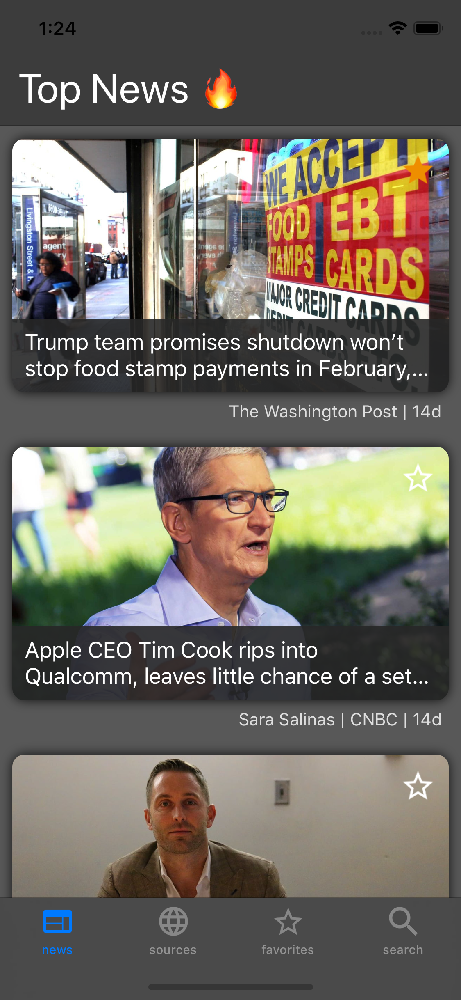
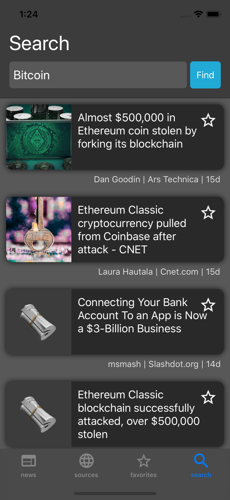
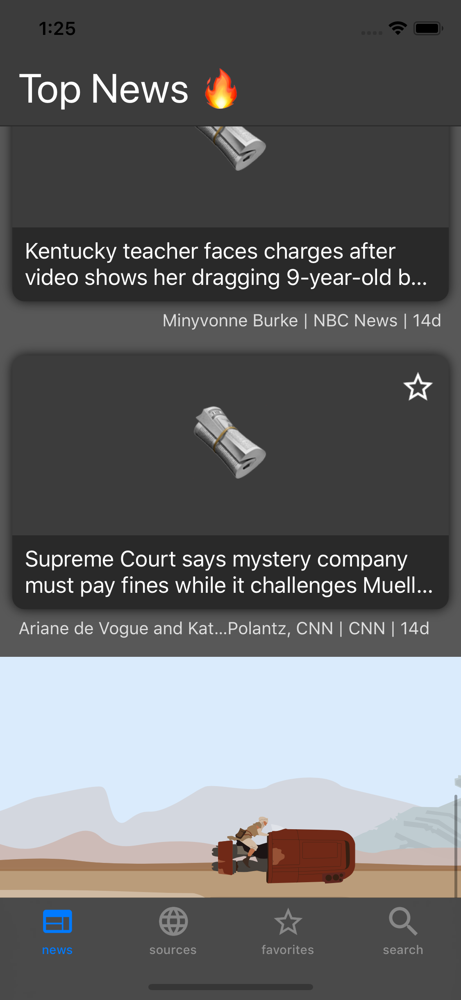

# News-Man 2.0

News-Man 9000 2.0 a news app sample that showcases best patterns and practices for building, testing, and deploying mobile apps using [Xamarin](https://visualstudio.microsoft.com/xamarin/), [Azure DevOps](https://azure.microsoft.com/en-us/solutions/devops/), and [AppCenter](https://appcenter.ms/)

## Prerequisites

There are two configruation available to run this sample application: Debug and Release. The the Debug configuration will run the app without additional actions and you will be able to access all pages of the app. In the Release configuration additional actions are required to run the sample in order to fetch real data from the real API source.

### Debug Configuration

The Debug configuration uses conditional compilation in order to inject the offline news data service. As a result, the real news feed is not required, all the data is prestored and available via the offline data service, including news by category, news by source and search. In order to run the app using this configuration you should select the Debug from the build configuration dropdown (selected by default) and run the sample source code.

### Release Configuration

The Release configuration replaces the offline data service with the online data service. To run the sample against the real news data feed, local app secrets need to be set up for your development environment. Please refer to the following **App Secrets** sections to get started.

## Backend

The sample uses the [News API](https://newsapi.org/) backend, where you can register and generate a developer key which is required to run this sample. Keep this value safe to be used later.

- **API Endpoint URL** *https://newsapi.org/v2/* has already been setup in the solution. 

## AppCenter

AppCenter integration is built in to the sample using the AppCenter NuGet packages for analytics and crashes. To get analytics in AppCenter, set up the iOS & Android apps and get the AppCenter secret key for each platform from the App's Overview tab.

## App Secrets

The following app secrets are defined in the **ServiceConfig** class and need to be replaced with the values generated in the steps above.

1. NewsServiceApiKey
2. AndroidAppCenterSecret
3. iOSAppCenterSecret

Be sure to configure the variables before deploying the app to avoid runtime errors. 

## Solution Overview

The solution consists of the following projects:
- MobCAT: The MobCAT library which contains useful services and pattern base classes
- MobCAT.Forms: The MobCAT Forms library which contains useful Forms base classes, services, behaviors, and converters
- News: The News Forms project which contains the XAML and shared code
- News.Android: The News Android specific project contains Android assets
- News.iOS: The News iOS specific project contains iOS assets
- News.UITests: The UI Test project

## MVVM

The app uses the [MVVM(Model-View-ViewModel)](https://docs.microsoft.com/en-us/xamarin/xamarin-forms/enterprise-application-patterns/mvvm) pattern to decouple business logic & presentation code. MVVM utility classes can be found in MobCAT/MVVM

## Service Container

The MobCAT library also includes a service container to register & consume services within the app. This enables registering platform specific services and consuming them through a common interface within shared code. It also enables mock services to be registered for UI test or unit test purposes.

## Bootstrap

Bootstrap.cs is where the app services are instantiated and registered in the ServiceContainer. Platform specific startup actions can also be invoked using the provided parameter in the Begin method. The Begin method is called from the AppDelegate for iOS, and MainActivity for Android respectively.
