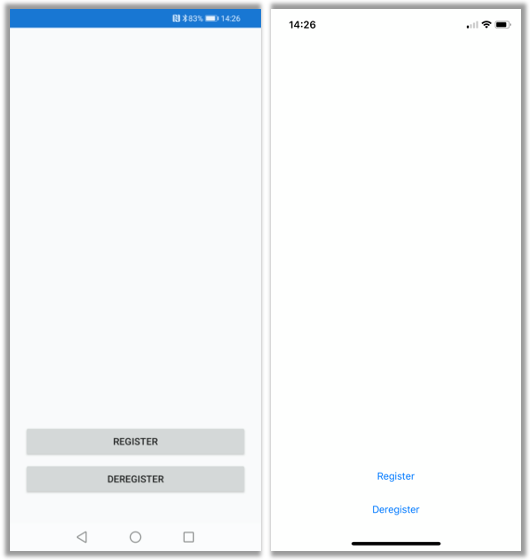
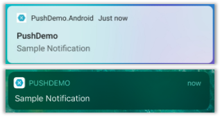
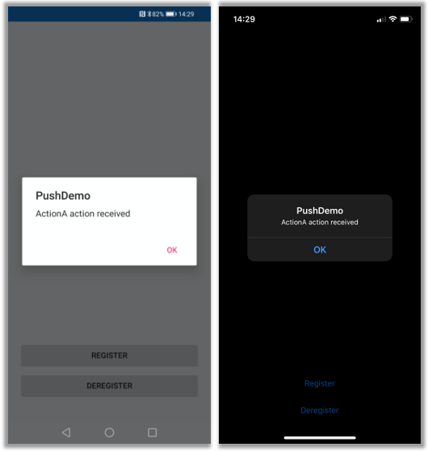

# Push notifications using Azure Notification Hubs via a backend service

Sample demonstrating the use of [Azure Notification Hubs](https://docs.microsoft.com/azure/notification-hubs/notification-hubs-push-notification-overview) via a backend service to send push notifications to **Android** and **iOS** applications.  

An [ASP.NET Core Web API](https://dotnet.microsoft.com/apps/aspnet/apis) backend is used to handle [device registration](https://docs.microsoft.com/azure/notification-hubs/notification-hubs-push-notification-registration-management#what-is-device-registration) on behalf of the client using the latest and best [Installation](https://docs.microsoft.com/azure/notification-hubs/notification-hubs-push-notification-registration-management#installations) approach via the [Notification Hubs SDK for backend operations](https://www.nuget.org/packages/Microsoft.Azure.NotificationHubs/), as shown in the guidance topic [Registering from your app backend](https://docs.microsoft.com/azure/notification-hubs/notification-hubs-push-notification-registration-management#registration-management-from-a-backend).

A cross-platform [Xamarin.Forms](https://dotnet.microsoft.com/apps/xamarin/xamarin-forms) application is used to demonstrate the use of the backend service using explicit register/deregister actions.  



Notifications will appear in the notification center when the app is stopped or in the background.



If a notification contains an action and is received when app is in the foreground, or where a notification is used to launch the application from notification center, a message is presented identifying the action specified.



> [!NOTE]
> You would typically perform the registration (and deregisration) actions during the appropriate point in the application lifecycle (or as part of your first-run experience perhaps) without explicit user register/deregister inputs. However, this example will require explicit user input to allow this functionality to be explored and tested more easily. The notification payloads are defined outside of the [Installation](https://docs.microsoft.com/dotnet/api/microsoft.azure.notificationhubs.installation?view=azure-dotnet) to allow experimentation without having to update existing installations via the service. [Custom templates](https://docs.microsoft.com/azure/notification-hubs/notification-hubs-templates-cross-platform-push-messages) would otherwise be ideal.

## Prerequisites

To run this sample your will need:

- An [Azure subscription](https://portal.azure.com) where you can create and manage resources.
- A Mac with [Visual Studio for Mac](https://visualstudio.microsoft.com/vs/mac/) installed (or a PC running [Visual Studio 2019](https://visualstudio.microsoft.com/vs) with the **Mobile Development with .NET** workload).
- The ability to run the app on either **Android** (physical or emulator devices) or **iOS** (physical devices only).

For Android, you must have:

- A developer unlocked physical device or an emulator *(running API 26 and above with Google Play Services installed)*.

For iOS, you must have:

- An active [Apple Developer Account](https://developer.apple.com).
- A physical iOS device that is [registered to your developer account](https://help.apple.com/developer-account/#/dev40df0d9fa) *(running iOS 13.0 and above)*.
- A **.p12** [development certificate](https://help.apple.com/developer-account/#/dev04fd06d56) installed in your **keychain** allowing you to [run an app on a physical device](#https://help.apple.com/xcode/mac/current/#/dev5a825a1ca).

> [!NOTE]
> The iOS Simulator does not support remote notifications and so a physical device is required when exploring this sample on iOS.

## Getting Started

A accompanying [tutorial](https://docs.microsoft.com/azure/notification-hubs/notification-hubs-backend-service-xamarin-forms) was written alongside this sample providing detailed steps on how to build it from scratch. High-level steps are otherwise provided below for getting the sample running on your own infrastructure to aid in further exploration.

### Platform Dependencies

#### Apple Push Notification Service (APNS)

1. Create an [APNS authentication token signing key](https://developer.apple.com/documentation/usernotifications/setting_up_a_remote_notification_server/establishing_a_token-based_connection_to_apns) (you can re-use an existing key if one exists).

1. Register an [explicit App ID](https://help.apple.com/developer-account/#/dev1b35d6f83) and configure it to [enable push notifications](https://help.apple.com/developer-account/#/dev4cb6dfbdb).

1. Create a [Provisioning Profile](https://help.apple.com/developer-account/#/devf2eb157f8) that can be used with your explicit **App ID**, **.p12** development certificate, and physical device.

#### Firebase Cloud Messaging (FCM)

1. Create a [Google Firebase project](https://cloud.google.com/solutions/mobile/mobile-firebase-app-engine-flexible#creating-project)

1. Register an [Android app](https://firebase.google.com/docs/cloud-messaging/android/first-message#register_your_app_with_firebase) with your **Google Firebase Project**.

### Backend

1. Provision a [Notification Hub](https://docs.microsoft.com/azure/notification-hubs) in the [Azure Portal](https://portal.azure.com) and configure it for use with [Firebase Cloud Messaging](https://docs.microsoft.com/azure/notification-hubs/configure-google-firebase-cloud-messaging) and [APNS](https://docs.microsoft.com/azure/notification-hubs/notification-hubs-push-notification-http2-token-authentication) (using the **Sandbox** option).

1. Optionally provision a suitable [compute resource](https://docs.microsoft.com/azure/architecture/guide/technology-choices/compute-decision-tree#understand-the-basic-features) to host the backend service e.g. [Azure App Service](https://docs.microsoft.com/azure/app-service).

1. Configure the [required app settings](#configure-backend-app-settings) for the backend service.

1. Publish the backend service e.g. [deploy app to Azure](https://docs.microsoft.com/aspnet/core/host-and-deploy/azure-apps/?view=aspnetcore-3.1&tabs=netcore-cli#publish-and-deploy-the-app) or [run it locally](https://docs.microsoft.com/dotnet/core/tools/dotnet-run).

### Mobile App

1. Update the placeholder [client config values](#update-mobile-app-config) to use the appropriate service endpoint and api key values.

#### Android

1. Update the **Package name** so it matches the value you defined in the [Android app](https://firebase.google.com/docs/cloud-messaging/android/first-message#register_your_app_with_firebase) you registered.

1. Download the [**google-services.json** file](https://support.google.com/firebase/answer/7015592?hl=en) from your **Firebase Project Settings page** and add it to the Android target/project.

#### iOS

1. Update the **Bundle identifier** so it matches the [App ID](https://help.apple.com/developer-account/#/dev1b35d6f83) that you registered in the [Apple Developer Portal](https://developer.apple.com).

1. Ensure that the appropriate **.p12** certificate and **Provisioning Profile** has been downloaded and is being used for **Bundle Signing**.

### Supporting details

#### Configure backend app settings

The backend service expects to have the following app settings defined:

- **Authentication:ApiKey**  
Choose your own API key e.g. a randomly generated GUID.

- **NotificationHub:Name**  
Found in the **Essentials** summary at the top of the [notification hub](https://docs.microsoft.com/azure/notification-hubs) **Overview** section.  

- **NotificationHub:ConnectionString**  
Use the connection string associated with the *DefaultFullSharedAccessSignature* **Access Policy**.

If you are publishing the service to [Azure App Service](https://docs.microsoft.com/azure/app-service), these would be added to the [app settings](https://docs.microsoft.com/azure/app-service/configure-common#configure-app-settings).  

> [!NOTE]
> Be sure to restart the service if you add/modify these settings after you have published the service.  

If you are running the service locally, these can be set via **Terminal** using the following commands with the [Secret Manager tool](https://docs.microsoft.com/aspnet/core/security/app-secrets?view=aspnetcore-3.1&tabs=linux#secret-manager) from the project directory.

```bash
dotnet user-secrets init
dotnet user-secrets set "NotificationHub:Name" <value>
dotnet user-secrets set "NotificationHub:ConnectionString" <value>
dotnet user-secrets set "Authentication:ApiKey" <value>
```

#### Update mobile app config

Find and replace the **API_KEY**, and **BACKEND_SERVICE_ENDPOINT** placeholder text with your own values. For example, in the Xamarin.Forms **PushDemo** project, these are defined within **Config.cs**.

```csharp
public static string ApiKey = "API_KEY";
public static string BackendServiceEndpoint = "BACKEND_SERVICE_ENDPOINT";
```

The **API_KEY** should match the **Authentication:ApiKey** app setting that you set for the backend service.  

The **BACKEND_SERVICE_ENDPOINT** should be the base address for the backend service (ending in a '/') e.g.

```html
https://localhost:5001/
```

If you are hosting the service using an [API App](https://azure.microsoft.com/services/app-service/api) in [Azure App Service](https://docs.microsoft.com/azure/app-service) then the URL should be in the following format:  

```html
https://<api_app_name>.azurewebsites.net/
```

## Sending notifications via the backend service

The backend service enables you to send push notifications in a cross-platform manner using the following parameters.

- **text:** String value representing the text that will appear in the notification *(mandatory when **silent** is **false**)*.
- **action:** String value representing the action that should performed *(mandatory when **silent** is **true**)*.
- **silent:** Boolean value indicating that the notification should be delivered silently (*default value is **false***).

### Sample Requests

#### Generic notification

```html
POST /api/notifications/requests HTTP/1.1
Host: <your_endpoint>
apikey: <your_api_key>
Content-Type: application/json

{
    "text": "Message from backend service",
    "action": "action_a"
}
```

#### Silent notification

```html
POST /api/notifications/requests HTTP/1.1
Host: <your_endpoint>
apikey: <your_api_key>
Content-Type: application/json

{
    "action": "action_b",
    "silent": true
}
```

## Browse code

- [Backend Service (ASP.NET Core)](https://github.com/xamcat/mobcat-samples/tree/master/notification_hub_backend_service/src/azure)  
- [Mobile App (Xamarin.Forms)](https://github.com/xamcat/mobcat-samples/tree/master/notification_hub_backend_service/src/xamarin)  
