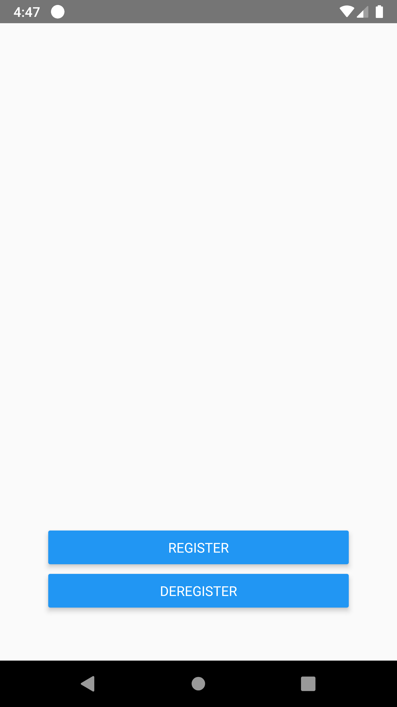
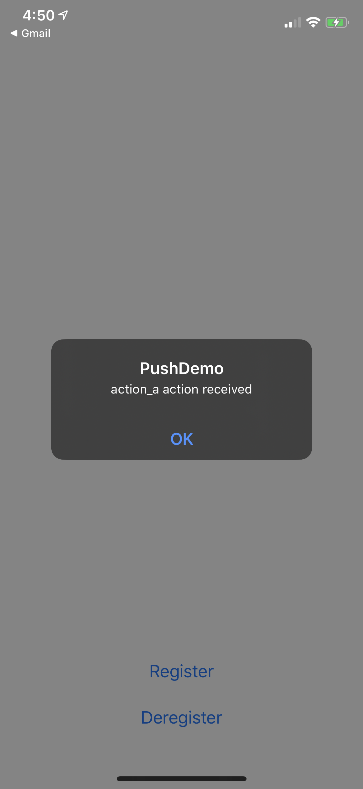
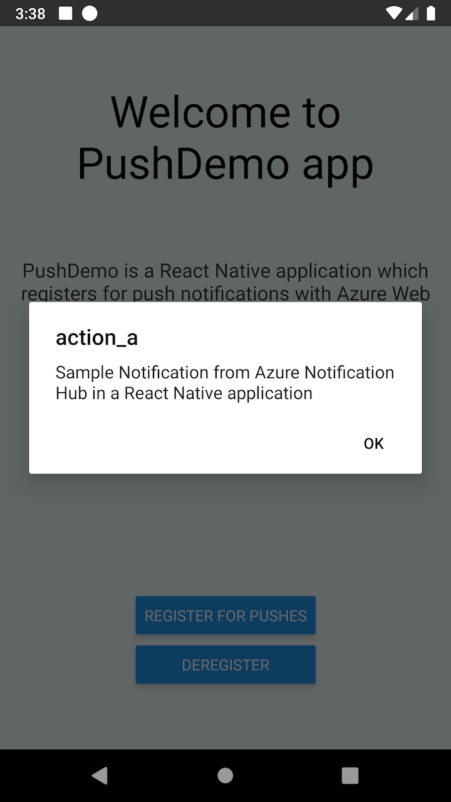
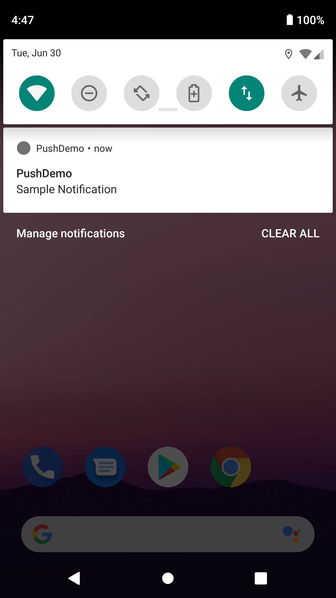

# React Native push notifications via backend service connected to Azure Notification Hub

## Background

Sample demonstrating the use of Azure Notification Hubs via a backend service to send push notifications to Android and iOS applications.

An ASP.NET Core Web API backend is used to handle device registration on behalf of the client using the latest and best Installation approach via the Notification Hubs SDK for backend operations, as shown in the guidance topic Registering from your app backend.

A cross-platform React Native application is used to demonstrate the use of the backend service using explicit register/deregister actions.




If a notification contains an action and is received when app is in the foreground, or where a notification is used to launch the application from notification center, a message is presented identifying the action specified.




Notifications will appear in the notification center when the app is stopped or in the background.




## Create a cross-platform React Native application

In this section, you build a React Native mobile application implementing push notifications in a cross-platform manner.

It enables you to register and deregister from a notification hub via the backend service that you created.

An alert is displayed when an action is specified and the app is in the foreground. Otherwise, notifications appear in notification center.

> [!NOTE]
> You would typically perform the registration (and deregistration) actions during the appropriate point in the application lifecycle (or as part of your first-run experience perhaps) without explicit user register/deregister inputs. However, this example will require explicit user input to allow this functionality to be explored and tested more easily.

### Prerequisites

- Visual Studio Code
- React Native Tools
- For Android, you must have:

  1. Android Studio
  1. A developer unlocked physical device or an emulator (running API 26 and above with Google Play Services installed).

- For iOS, you must have:

  1. Xcode and physical device
  1. An active Apple Developer Account.
  1. A physical iOS device that is registered to your developer account (running iOS 13.0 and above).
  1. A .p12 development certificate installed in your keychain allowing you to run an app on a physical device.

### Create the React Native solution

1. In `Terminal`, update your environment tools, required to work with React Native using the following commands:

```bash
# install node
brew install node
# or update
brew update node
# install wathcman
brew install watchman
# or update
brew upgrade watchman
# install cocoapods
sudo gem install cocoapods
```

1. In `Terminal`, run the following command, if you have `React Native` CLI installed to uninstall it. You are going to use `npx` to automatically use the latest React Native CLI version available:

```bash
npm uninstall -g react-native-cli
```

> [!NOTE]
> React Native has a built-in command line interface. Rather than install and manage a specific version of the CLI globally, we recommend you access the current version at runtime using `npx`, which ships with Node.js. With `npx react-native <command>`, the current stable version of the CLI will be downloaded and executed at the time the command is run.

1. Navigate to your projects folder where you want to create the new application. Use the Typescript based template by specifying the `--template` parameter:

```bash
# init new project with npx
npx react-native init PushDemo --template react-native-template-typescript

```

1. Run metro server which builds javascript bundles as well as monitors any code updates to refresh it on the fly:

```bash
cd PushDemo
npx react-native start
```

1. Run the iOS app to verify the setup. Make sure you started an iOS simulator or connected an iOS device, before executing the following command:

```bash
npx react-native run-ios
```

1. Run the Android app to verify the setup. This requires a few additional steps in order to configure an Android emulator or device to be able accessing the React Native metro server. The following commands generate initial javascript bundle for Android and put it into the assets folder.

```bash
# create assets folder for the bundle
mkdir android/app/scr/main/assets
# build the bundle
npx react-native bundle --platform android --dev true --entry-file index.js --bundle-output android/app/src/main/assets/index.android.bundle --assets-dest android/app/src/main/res
# enable ability for sim to access the localhost
adb reverse tcp:8081 tcp:8081
```

This script will be pre-deployed with the initial version of the app, where you will be able to configure your emulator or device to access the metro server by specifying the server ip address. Execute the following command to build and run the Android application:

```bash
npx react-native run-android
```

Once in the app, hit `CMD+M` (emulator) or shake the device to populate the developer settings, navigate to `Settings` > `Change Bundle Location` and specify the metro server ip address with the default port: `<metro-server-ip-address>:8081`.

1. In the `App.tsx` file apply any change to the page layout, save it and make the change is automatically reflected in both iOS and Android apps.

> [!NOTE]
> Detailed development environment setup guide is available in the [official documentation](https://reactnative.dev/docs/environment-setup)

### Install required packages

You need the 3 following packages for this sample to work:

1. [React Native Push Notifications iOS](https://www.npmjs.com/package/@react-native-community/push-notification-ios) - [Project GitHub](https://github.com/react-native-community/push-notification-ios)

    This module was created when the PushNotificationIOS was split out from the core of React Native. The package natively implements push notifications for iOS and provides React Native interface to access it. Run the following command to install the package:

    ```bash
    yarn add @react-native-community/push-notification-ios
    ```

1. [React Native Push Notifications Cross-platform](https://www.npmjs.com/package/react-native-push-notification)

    This module implements local and remote notifications on iOS and Android. The previous module is the only dependency for this one. Run the following command to install the package:

    ```bash
    yarn add react-native-push-notification
    ```

1. [Device info package](https://www.npmjs.com/package/react-native-device-info)
    The module provides information about a device in runtime, you will use it to define a device identifier, which is used to register for push notification. Run the following command to install the package:

    ```bash
    yarn add react-native-device-info
    ```

### Implement the cross-platform components

1. DemoNotificationHandler

```typescript
import PushNotification from 'react-native-push-notification';

class DemoNotificationHandler {
  private _onRegister: any;
  private _onNotification: any;
  
  onNotification(notification: any) {
    console.log('NotificationHandler:', notification);

    if (typeof this._onNotification === 'function') {
      this._onNotification(notification);
    }
  }

  onRegister(token: any) {
    console.log('NotificationHandler:', token);

    if (typeof this._onRegister === 'function') {
      this._onRegister(token);
    }
  }

  attachTokenReceived(handler: any) {
    this._onRegister = handler;
  }

  attachNotificationReceived(handler: any) {
    this._onNotification = handler;
  }
}

const handler = new DemoNotificationHandler();

PushNotification.configure({
  onRegister: handler.onRegister.bind(handler),
  onNotification: handler.onNotification.bind(handler),
  permissions: {
    alert: true,
    badge: true,
    sound: true,
  },
  popInitialNotification: true,
  requestPermissions: true,
});

export default handler;
```

1. DemoNotificationService

```typescript
import PushNotification from 'react-native-push-notification';
import DemoNotificationHandler from './DemoNotificationHandler';

export default class DemoNotificationService {
  constructor(onTokenReceived: any, onNotificationReceived: any) {
    DemoNotificationHandler.attachTokenReceived(onTokenReceived);
    DemoNotificationHandler.attachNotificationReceived(onNotificationReceived);
    PushNotification.getApplicationIconBadgeNumber(function(number: number) {
      if(number > 0) {
        PushNotification.setApplicationIconBadgeNumber(0);
      }
    });
  }

  checkPermissions(cbk: any) {
    return PushNotification.checkPermissions(cbk);
  }

  requestPermissions() {
    return PushNotification.requestPermissions();
  }

  cancelNotifications() {
    PushNotification.cancelLocalNotifications();
  }

  cancelAll() {
    PushNotification.cancelAllLocalNotifications();
  }

  abandonPermissions() {
    PushNotification.abandonPermissions();
  }
}
```

1. DemoNotificationRegistrationService

```typescript
export default class DemoNotificationService {
    constructor(
        readonly apiUrl: string,
        readonly apiKey: string) {

    }

    async registerAsync(request: any): Promise<Response> {
        const method = 'PUT';
        const registerApiUrl = `${this.apiUrl}/notifications/installations`;
        const result = await fetch(registerApiUrl, {
            method: method,
            headers: {
                Accept: 'application/json',
                'Content-Type': 'application/json',
                'apiKey': this.apiKey
            },
            body: JSON.stringify(request)
        });

        this.validateResponse(registerApiUrl, method, request, result);
        return result;
    }

    async deregisterAsync(deviceId: string): Promise<Response> {
        const method = 'DELETE';
        const deregisterApiUrl = `${this.apiUrl}/notifications/installations/${deviceId}`;
        const result = await fetch(deregisterApiUrl, {
            method: method,
            headers: {
                Accept: 'application/json',
                'Content-Type': 'application/json',
                'apiKey': this.apiKey
            }
        });

        this.validateResponse(deregisterApiUrl, method, null, result);
        return result;
    }

    private validateResponse(requestUrl: string, method: string, requestPayload: any, response: Response) {
        console.log(`Request: ${method} ${requestUrl} => ${JSON.stringify(requestPayload)}\nResponse: ${response.status}`);
        if (!response || response.status != 200) {
            throw `HTTP error ${response.status}: ${response.statusText}`;
        }
    }
}
```

1. Configure the app. Open `package.json` and add the following script definition:

```json
"configure": "cp .app.config.tsx src/config/AppConfig.tsx"
```

Then execute this script which will copy the default config to the `config` folder.

```bash
yarn configure
```

Final step is to update the configuration file copied at the previous step with the API access information. Specify `apiKey` and `apiUrl` parameters:

```typescript
module.exports = {
    appName: "PushDemo",
    env: "production",
    apiUrl: "https://<azure-push-notifications-api-url>/api/",
    apiKey: "<api-auth-key>",
};
```

### Implement the cross-platform UI

1. Define page layout

```typescript
<View style={styles.container}>
  {this.state.isBusy &&
    <ActivityIndicator></ActivityIndicator>
  }
  <View style={styles.button}>
    <Button title="Register" onPress={this.onRegisterButtonPress.bind(this)} disabled={this.state.isBusy} />
  </View>
  <View style={styles.button}>
    <Button title="Deregister" onPress={this.onDeregisterButtonPress.bind(this)} disabled={this.state.isBusy} />
  </View>
</View>
```

1. Apply styles

```css
const styles = StyleSheet.create({
  container: {
    flex: 1,
    alignItems: "center",
    justifyContent: 'flex-end',
    margin: 50,
  },
  button: {
    margin: 5,
    width: "100%",
  }
});
```

1. Initialize the page component

```typescript
  state: IState;
  notificationService: DemoNotificationService;
  notificationRegistrationService: DemoNotificationRegistrationService;
  deviceId: string;

  constructor(props: any) {
    super(props);
    this.deviceId = DeviceInfo.getUniqueId();
    this.state = {
      status: "Push notifications registration status is unknown",
      registeredOS: "",
      registeredToken: "",
      isRegistered: false,
      isBusy: false,
    };

    this.notificationService = new DemoNotificationService(
      this.onTokenReceived.bind(this),
      this.onNotificationReceived.bind(this),
    );

    this.notificationRegistrationService = new DemoNotificationRegistrationService(
      Config.apiUrl,
      Config.apiKey,
    );
  }
```

1. Define button click handlers

```typescript
  async onRegisterButtonPress() {
    if (!this.state.registeredToken || !this.state.registeredOS) {
      Alert.alert("The push notifications token wasn't received.");
      return;
    }

    let status: string = "Registering...";
    let isRegistered = this.state.isRegistered;
    try {
      this.setState({ isBusy: true, status });
      const pnPlatform = this.state.registeredOS == "ios" ? "apns" : "fcm";
      const pnToken = this.state.registeredToken;
      const request = {
        installationId: this.deviceId,
        platform: pnPlatform,
        pushChannel: pnToken,
        tags: []
      };
      const response = await this.notificationRegistrationService.registerAsync(request);
      status = `Registered for ${this.state.registeredOS} push notifications`;
      isRegistered = true;
    } catch (e) {
      status = `Registration failed: ${e}`;
    }
    finally {
      this.setState({ isBusy: false, status, isRegistered });
    }
  }

  async onDeregisterButtonPress() {
    if (!this.notificationService)
      return;

    let status: string = "Deregistering...";
    let isRegistered = this.state.isRegistered;
    try {
      this.setState({ isBusy: true, status });
      await this.notificationRegistrationService.deregisterAsync(this.deviceId);
      status = "Deregistered from push notifications";
      isRegistered = false;
    } catch (e) {
      status = `Deregistration failed: ${e}`;
    }
    finally {
      this.setState({ isBusy: false, status, isRegistered });
    }
  }
```

1. Handle received token registrations and push notifications

```typescript
  onTokenReceived(token: any) {
    console.log(`Received a notification token on ${token.os}`);
    this.setState({ registeredToken: token.token, registeredOS: token.os, status: `The push notifications token has been received.` });

    if (this.state.isRegistered && this.state.registeredToken && this.state.registeredOS) {
      this.onRegisterButtonPress();
    }
  }

  onNotificationReceived(notification: any) {
    console.log(`Received a push notification on ${this.state.registeredOS}`);
    this.setState({ status: `Received a push notification...` });

    if (notification.data.message) {
      Alert.alert(AppConfig.appName, `${notification.data.action} action received`);
    }
  }
};
```

## Configure the native Android project for push notifications

### Configure required Android packages

TBD

### Validate package name and permissions

TBD

### Add the Google Services JSON file

TBD

### Handle push notifications for Android

TBD

## Configure the native iOS project for push notifications

### Configure required iOS packages

The package is [automatically linked](https://github.com/react-native-community/cli/blob/master/docs/autolinking.md) when building the app. All you need to do is to install the native pods:

```bash
npx pod-install
```

### Configure Info.plist and Entitlements.plist

1. Go into your "PushDemo/ios" folder and open "PushDemo.xcworkspace" workspace, select the top project "PushDemo" and select the "Signing & Capabilities" tab.

1. Update Bundle Identifier to match the value used in the provisioning profile.

1. Add 2 new Capabilities using the - "+" button:

- Background Mode capability and tick Remote Notifications.
- Push Notifications capability

### Handle push notifications for iOS

1. Open "AppDelegate.h" and add the following import:

```objective-c
#import <UserNotifications/UNUserNotificationCenter.h>
```

1. Update list of protocols, supported by the "AppDelegate", by adding `UNUserNotificationCenterDelegate`:

```objective-c
@interface AppDelegate : UIResponder <UIApplicationDelegate, RCTBridgeDelegate, UNUserNotificationCenterDelegate>
```

1. Open "AppDelegate.m" and configure all the required iOS callbacks:

```objective-c
#import <UserNotifications/UserNotifications.h>
#import <RNCPushNotificationIOS.h>

...

// Required to register for notifications
- (void)application:(UIApplication *)application didRegisterUserNotificationSettings:(UIUserNotificationSettings *)notificationSettings
{
 [RNCPushNotificationIOS didRegisterUserNotificationSettings:notificationSettings];
}

// Required for the register event.
- (void)application:(UIApplication *)application didRegisterForRemoteNotificationsWithDeviceToken:(NSData *)deviceToken
{
 [RNCPushNotificationIOS didRegisterForRemoteNotificationsWithDeviceToken:deviceToken];
}

// Required for the notification event. You must call the completion handler after handling the remote notification.
- (void)application:(UIApplication *)application didReceiveRemoteNotification:(NSDictionary *)userInfo
fetchCompletionHandler:(void (^)(UIBackgroundFetchResult))completionHandler
{
  [RNCPushNotificationIOS didReceiveRemoteNotification:userInfo fetchCompletionHandler:completionHandler];
}

// Required for the registrationError event.
- (void)application:(UIApplication *)application didFailToRegisterForRemoteNotificationsWithError:(NSError *)error
{
 [RNCPushNotificationIOS didFailToRegisterForRemoteNotificationsWithError:error];
}

// IOS 10+ Required for localNotification event
- (void)userNotificationCenter:(UNUserNotificationCenter *)center
didReceiveNotificationResponse:(UNNotificationResponse *)response
         withCompletionHandler:(void (^)(void))completionHandler
{
  [RNCPushNotificationIOS didReceiveNotificationResponse:response];
  completionHandler();
}

// IOS 4-10 Required for the localNotification event.
- (void)application:(UIApplication *)application didReceiveLocalNotification:(UILocalNotification *)notification
{
 [RNCPushNotificationIOS didReceiveLocalNotification:notification];
}

//Called when a notification is delivered to a foreground app.
-(void)userNotificationCenter:(UNUserNotificationCenter *)center willPresentNotification:(UNNotification *)notification withCompletionHandler:(void (^)(UNNotificationPresentationOptions options))completionHandler
{
  completionHandler(UNAuthorizationOptionSound | UNAuthorizationOptionAlert | UNAuthorizationOptionBadge);
}
```
