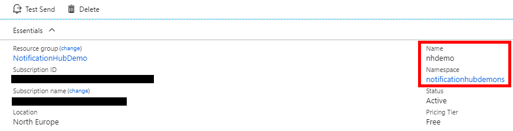
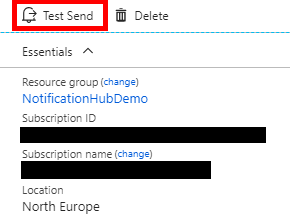
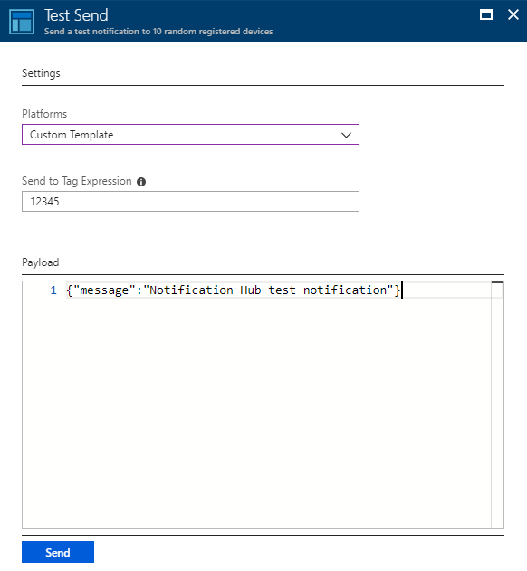
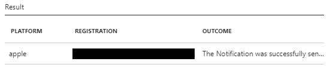
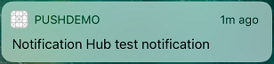

###### Walkthrough: Push notifications for Swift iOS apps using the Notification Hub REST API

# Introduction 
Push notifications enable backend services to disseminate information to mobile devices even when the app on the device is not active. This can aid in keeping users engaged, app content up-to-date, and supporting other asynchronous workflows.

While the infrastructure required to support this is fairly complex, [Azure Notification Hub](https://docs.microsoft.com/en-us/azure/notification-hubs/notification-hubs-push-notification-overview) abstracts the details of the underlying **PNS (Platform Notification Service)** enabling you to send mobile push notifications to any mobile platform with a single API call.

There is plenty of documentation providing further background on [Notification Hubs](https://docs.microsoft.com/en-us/azure/notification-hubs/notification-hubs-push-notification-overview) and [why you should consider them](https://docs.microsoft.com/en-us/azure/notification-hubs/notification-hubs-push-notification-overview#why-use-azure-notification-hubs) as part of your backend solution along with detailed steps on how to get everything provisioned, configured and connected via the [client and server SDKs]((https://www.nuget.org/packages/Microsoft.Azure.NotificationHubs/)). A consideration to bear in mind, when handling the registration from the client itself, is that whilst supported in the backend SDK, the client SDK does not yet (at time of writing) support the preferred [installation approach](https://docs.microsoft.com/en-us/azure/notification-hubs/notification-hubs-push-notification-registration-management#installations) and so you must use the [REST API](https://msdn.microsoft.com/en-us/library/azure/dn223264.aspx).

The goal of this post is to provide a high-level overview of the available options for connecting your client app to Notification Hub before walking the path less travelled by connecting a Swift-based iOS app to a Notification Hub from the client using the [REST API](https://msdn.microsoft.com/en-us/library/azure/dn223264.aspx).  

## Connecting to Notification Hub
There are a couple of key decisions to consider up-front when working with Notification Hubs:  

- Whether to handle registration directly via the client
- Deciding which **Device Registration** option to use

### Handling Registration (client vs service)
The two main patterns for registering devices with Notification Hub is to handle this directly from the device or indirectly through an application backend service. 

Regardless of the chosen approach, you must supply a PNS handle for each device and channel. This is acquired within the client app itself. On iOS, this is provided within the *didRegisterForRemoteNotificationsWithDeviceToken* method in AppDelegate. In Android, this is provided by the Firebase Identity service.  

Once you have a valid PNS handle, the device registration can be either handled by the client app directly or vicariously through a backend service.

When handled by the client directly, the backend is responsible only for sending notifications. The client assumes the responsibility for keeping the PNS handle up-to-date on the Notification Hub and must manage things like tags itself.

When you use a service to handle the registration, the client app must still provide an updated PNS handle each time it is launched but the service takes care of everything else.

The backend service approach is the preferred option in most cases for the following reasons:
- Ability to handle changes outside of app releases
- Better enables scaling beyond a single hub
- Logic is encapsulated in a single place

While the service-based approach is advantageous in many cases, the direct approach might be considered an easier on-ramp and is perfectly sufficient for many scenarios.  

[Registration Management](https://docs.microsoft.com/en-us/azure/notification-hubs/notification-hubs-push-notification-registration-management) is covered in greater detail in the official documentation, however this should hopefully provide sufficient context.

### Device Registration Options

Whether you choose to handle the registration directly or indirectly ([client vs service](#handling-registration-(client-vs-service))), there are currently two available options for registering a device with Notification Hub:

**Registration:**  
The original approach to connecting devices to Notification Hub. This associates the PNS handle for a given device with tags and optionally a template. The REST APIs are XML based and are generally less enjoyable to work with (compared to the installation APIs) however this can be used via both [client and server SDKs](https://www.nuget.org/packages/Microsoft.Azure.NotificationHubs/).  

**Installation:**  
This is the latest and 'best' approach to connecting devices to Notification Hub. It is described as an 'enhanced registration' and has the following advantages over the original registration approach:

- Fully idempotent so you can retry it without risking duplicate registrations
- Easier to do individual pushes targeting specific devices
- Ability to update the registration without having to delete and resend in its entirity
- Nicer JSON based API that is easier to work with overall

### Summary
Handing registration via an intermediary service using the installation approach will be the preferred option for most. In this case you can use either the [Notification Hub SDK](https://www.nuget.org/packages/Microsoft.Azure.NotificationHubs/) or the  [Notification Hub REST API](https://msdn.microsoft.com/en-us/library/azure/dn223264.aspx).

In situations where handling registration directly via the client is preferred, it will be a choice between using the [Notification Hub SDK](https://www.nuget.org/packages/Microsoft.Azure.NotificationHubs/) with the original registration approach or using the [Notification Hub REST API](https://msdn.microsoft.com/en-us/library/azure/dn223264.aspx) in order to use the newer (and best) installation approach.  

# Walkthrough
I have chosen iOS and Swift for the client example as it currently has the least amount of documentation available compared to other platforms and languages. 

For the initial part of the walkthrough, concerning the configuration of the underlying PNS and the Azure Notification Hub, I'm actually going to pull together existing online documentation. The official documentation does an excellent job of describing the steps involved but I wanted to provide a single end-to-end sequence that is specific to this example. I will provide links to the relevant official documentation for each step. 

## Prerequisites
In order to follow along, you will need:

- An active [Apple Developer Account](https://developer.apple.com) 
- A Mac with Xcode along with a valid developer certificate installed into your Keychain
- A physical iPhone device you can run and debug with (it is not possible to test push notifications with the simulator)
- Your physical iPhone device registered in the [Apple Portal](https://developer.apple.com) and associated with your certificate
- An [Azure Subscription](https://portal.azure.com) where you can create and manage resources

It should be possible to follow along to create this first-principles example without prior experience. However, familiarity with the following concepts will be beneficial:

- Building iOS apps with Xcode and Swift
- Configuring an [Azure Notification Hub](https://docs.microsoft.com/en-us/azure/notification-hubs/notification-hubs-ios-apple-push-notification-apns-get-started) for iOS
- Familiarity with the [Apple Developer Portal](https://developer.apple.com) and the [Azure Portal](https://portal.azure.com)

**NOTE:** The Notification Hub will be configured to use the *Sandbox* authentication mode only. You should not use this for production workloads.

## Apple Developer Portal
First we must configure the requisite certificate for the **Notification Hub**, and a specific **App ID** and **Provisioning Profile** for the client app. The high-level steps are:  
- Generating the **CSR** (Certificate Signing Request)
- Registering the app (**App ID**) for push notifications
- Creating a **Provisioning Profile** for the app 

### Generating the CSR (Certificate Signing Request)
1. Open the **Keychain Access** tool on your Mac
2. Click **Keychain Access**, expand **Certificate Assistant**, then click **Request a Certificate From a Certificate Authority**
3. Enter the following fields, then click **Continue**: 

    
    **User Email Address:** Enter an email (typically the one associated with your **Apple Developer Account**)  
    **Common Name:** Enter a short name for the certificate (this is how it will appear in **Keychain**)  
    **Saved to disk:** Choose this option to save the signing request file to your local machine
    
       
4. Enter a name for the **CSR** file in **Save As** and a convenient save location in **Where**, then click **Save**

### Registering the app for push notifications
1. Go to the **Apple Developer Portal**
2. Navigate to **Certificates**, **Identifiers & Profiles**
3. Click **Identifiers**, **App IDs** then click **+** to register a new app
4. Update the following three fields then click **Continue**: 

    
    **Name:** Provide a meaningful name for the app  
    **Bundle Identifier:** Enter a bundle identifier in the reverse namespace form *'com.\<organization\>.\<PushDemo\>'*   
    **Push Notifications:** Ensure that the **Push Notifications** option is checked in the **App Services** section
    
       
5. Click **Register** and then **Done**
6. In the **Developer Portal**, under **App IDs**, verify that the **App ID** you just created is listed
7. Click on the **App ID** row then click the **Edit** button at the bottom
8. Scroll to the bottom, click the **Create Certificate** button (under the **Development Push SSL Certificate** section). The **'Add iOS Certificate'** assistant should now be visible. NOTE: you can alternatively [configure the hub using a token](https://docs.microsoft.com/en-us/azure/notification-hubs/notification-hubs-push-notification-http2-token-authentification) if you would prefer to do do 
9. Click **Choose File** to upload the **CSR** file you created earlier, then click **Generate**
10. Download the certificate to a convenient location
11. Double-click the downloaded certificate (**.cer**) to install it into the **Keychain**
12. In **Keychain Access**, **Command+Click** the new certificate, then click **Export**
13. Choose the **.p12** format, provide a meaningful name and then click **Save**
14. Provide a suitable password for the certificate (This will be required later)

### Creating a provisioning profile for the app
1. Back in the **Apple Developer Portal**, click **Provisioning Profiles** and select **All**
2. Click the **+** button to create a new profile via the **iOS Provisioning Profile Wizard**
3. Choose **iOS App Development** under the **Development Options** as the profile type then click **Continue**
4. Select the appropriate **App ID** (the one created in the [registering the app for push notifications](#registering-the-app-for-push-notifications) step) from the list, then click **Continue**
5. Select your usual **Development Certificate** (used for code signing), then click **Continue**. NOTE: This certificate is **_NOT_** the push certificate that was created earlier
6. Choose the **Devices** you wish to use for testing (this assumes you have previously registered a device), then click **Continue**
7. Pick a meaningful name for the profile, then click **Generate**
8. Download the new **Provisioning Profile** and install it on your **Xcode** development machine, then click **Done**

## Azure Portal
The next step is to provision and configure a Notitifation Hub in the [Azure Portal](https://portal.azure.com).  

### Provisioning the Noficiation Hub
1. Navigate and sign in to the **Azure Portal**
2. Click **Create a resource**, choose **Web + Mobile**, then select **Notification Hub**
3. Update the folllowing 6 fields, then click **Create**

    
    **Notification Hub:** Enter a name for the **Notification Hub**  
    **Create a new namespace:** Enter a globally unique name for the **Notification Hub** namespace  
    **Location:** Choose a suitable location from the drop-down list  
    **Resource Group:** Enter a unique name for a new **Resource Group** (or pick an existing one)  
    **Subscription:** Choose the target **Subscription** from the drop-down list  
    **Pricing Tier:** Keep the default **Free** option (unless you have reached the maximum number of hubs on the free tier)
    
       
4. Once the **Notification Hub** has been provisioned, navigate to that resource

### Configuring the Notificiation Hub for Apple Push Notifications
1. Navigate to your new **Notification Hub** in the **Azure Portal**	
2. Select **Access Policies** from the list (under **MANAGE**)
3. Take a note of the **Policy Name** values along with their corresponding **Connection Strings** 
4. Select **Apple (APNS)** from the list (under **NOTIFICATION SERVICES**)
5. Choose **Certificate** for the **Authentication Mode**
6. Upload the **.p12** file (exported as part of the [registering the app for push notifications](#registering-the-app-for-push-notifications) step)
7. Specify the **Password** for the certificate
8. Choose **Sandbox** as the **Application Mode**
9. Click **Save** to ensure the changes are applied

## Xcode
In this section, we will build the iOS app that will connect to the Notification Hub.  

### Creating a new iOS project
1. In **Xcode**, create a new iOS project and select the **Single View Application** template
2. When setting the options for the new project, be sure to use the same **Product Name** (i.e. PushDemo) and **Organization Identifier** (i.e. com.\<organization\>) that you used when the **Bundle Identifier** was set in the **Apple Developer Portal**. Also, choose the **Team** that the **App ID** was setup for, set the **language** to **Swift**, then click **Next**
3. Create a new folder called **SupportingFiles**
4. Create a new **plist** file called **devsettings.plist** under the **SupportingFiles** folder. Be sure to add this to your **gitignore** file so it is not committed when working with a **git repo**. In a production app, you would likely be conditionally setting these secrets as part of an automated build process however this is not covered as part of this walkthrough
5. Update **devsettings.plist** to include the following configuration entries (using your own values from the **Notification Hub** you provisioned):

   | Key                            | Type                     | Value                     |               
   |--------------------------------| -------------------------| --------------------------|
   | notificationHubKey             | String                   | \<hubKey\>                |
   | notificationHubKeyName         | String                   | \<hubKeyName\>            |
   | notificationHubName            | String                   | \<hubName\>               |
   | notificationHubNamespace       | String                   | \<hubNamespace\>          |
    
   You can find the requisite values by navigating to the **Notification Hub** resource in the **Azure Portal**.  

   The **notificationHubName** and the **notificationHubNamespace** values are found in the top-right of the **Essentials** summary within **Overview**.

   

   The **notificationHubKeyName** and the **notificationHubKey** are found by navigating to **Access Policies**, clicking on the respective **Access Policy** e.g. *DefaultFullSharedAccessSignature*. Then copy from the **Primary Connection String** the value prefixed with *'SharedAccessKeyName='* for *notificationHubKeyName* and the value prefixed with *'SharedAccessKey='* for the **notificationHubKey**. The connection string should be in the following format:
    
   ```
   Endpoint=sb://<namespace>.servicebus.windows.net/;SharedAccessKeyName=<notificationHubKeyName>;SharedAccessKey=<notificationHubKey>
   ```

   For simplicity, we'll use *DefaultFullSharedAccessSignature* so we can use the token to send notifications as well. However, in practice the *DefaultListenSharedAccessSignature* would be a better choice for situations where we only want to receive notifications.

       
6. Under **Project Navigator**, click the **Project Name**, then click the **General** tab
7. Find **Identity**, then set the **Bundle Identifier** value so it matches the one used for the **App ID** (from the earlier [registering the app for push notifications](#registering-the-app-for-push-notifications) step) i.e. *'com.\<organization\>.PushDemo'*
8. Find **Signing**, then make sure you select the appropriate **Team** for your **Apple Developer Account** (the one under which you had created your certificates and profiles earlier).  **Xcode** should automatically pull down the appropriate **Provisioning Profile** based on the **Bundle Identifier**. If you don't see the new **Provisioning Profile**, try refreshing the profiles for the **Signing Identity** (*Xcode > Preferences > Account > View Details*). Clicking on the **Signing Identity**, then clicking the **Refresh** button in the bottom-right should download the profiles.
9. Select the **Capabilities** tab and ensure that **Push Notifications** are enabled
10. Open your **AppDelegate.swift** file to implement the *UNUserNotificationCenterDelegate* protocol and add the following code to the top of the class:
    
    ```
    @UIApplicationMain
    class AppDelegate: UIResponder, UIApplicationDelegate, UNUserNotificationCenterDelegate {
        
        ...

        var configValues: NSDictionary?
        var notificationHubNamespace : String?
        var notificationHubName : String?
        var notificationHubKeyName : String?
        var notificationHubKey : String?
        let tags = ["12345"]
        let genericTemplate = PushTemplate(withBody: "{\"aps\":{\"alert\":\"$(message)\"}}")
        
        ...
    }
    ```

    We will use these members later. The *tags* and *genericTemplate* will be used as part of the registration. For further background, the official documentation provides more detail on [tag expressions](https://msdn.microsoft.com/en-us/library/azure/dn530749.aspx) and [custom templates](https://msdn.microsoft.com/en-us/library/azure/dn530748.aspx).
 
11. In the same file, add the following code in the *didFinishLaunchingWithOptions* function:

    ```
    if let path = Bundle.main.path(forResource: "devsettings", ofType: "plist") {
        if let configValues = NSDictionary(contentsOfFile: path) {
            self.notificationHubNamespace = configValues["notificationHubNamespace"] as? String
            self.notificationHubName = configValues["notificationHubName"] as? String
            self.notificationHubKeyName = configValues["notificationHubKeyName"] as? String
            self.notificationHubKey = configValues["notificationHubKey"] as? String
        }
    }
        
    if #available(iOS 10.0, *){
        UNUserNotificationCenter.current().delegate = self
        UNUserNotificationCenter.current().requestAuthorization(options: [.alert, .sound, .badge]) {
            (granted, error) in
                
            if (granted)
            {
                DispatchQueue.main.async {
                    application.registerForRemoteNotifications()
                }
            }
        }
    }

    return true
    ```

    This code retrieves the setting values from **devsettings.plist**, sets the **AppDelegate** class as the *UNUserNotificationCenter* delegate, requests authorization for push notifications then subsequently calls *registerForRemoteNotifications*.
	
	For simplicity, we're supporting **iOS 10 and above only**. Support for older OS versions can be added by conditionally using the respective APIs and approaches as you would normally do.

12. In the same file, add the following functions:

    ```
    func application(_ application: UIApplication, didRegisterForRemoteNotificationsWithDeviceToken deviceToken: Data) {
        let installationId = (UIDevice.current.identifierForVendor?.description)!
        let pushChannel = deviceToken.reduce("", {$0 + String(format: "%02X", $1)})
    }

    func showAlert(withText text : String) {
        let alertController = UIAlertController(title: "PushDemo", message: text, preferredStyle: UIAlertControllerStyle.alert)
        alertController.addAction(UIAlertAction(title: "OK", style: UIAlertActionStyle.default,handler: nil))
        self.window?.rootViewController?.present(alertController, animated: true, completion: nil)
    }
    ```

    We will use the *installationId* and *pushChannel* values to register with the **Notification Hub** once we have added the necessary components. In this case we're using *UIDevice.current.identifierForVendor* to provide us with a unique value to identify the device and then perform some formatting on the *deviceToken* to provide us with the desired *pushChannel* value. The *showAlert* function is simply to facilitate the display of some message text for demonstration purposes.

13. Still in **AppDelegate.swift**, add the *willPresent* and *didReceive* **UNUserNotificationCenterDelegate** functions to display an alert when the notification arrived when the app is running in the foreground and background respectively
    
    ```
    @available(iOS 10.0, *)
    func userNotificationCenter(_ center: UNUserNotificationCenter, 
        willPresent notification: UNNotification, 
        withCompletionHandler completionHandler: @escaping (UNNotificationPresentationOptions) -> Void) {
        showAlert(withText: notification.request.content.body)
    }
    
    @available(iOS 10.0, *)
    func userNotificationCenter(_ center: UNUserNotificationCenter, 
        didReceive response: UNNotificationResponse, 
        withCompletionHandler completionHandler: @escaping () -> Void) {
        showAlert(withText: response.notification.request.content.body)
    }
    ```    

14. Add print statements to the bottom of the *didRegisterForRemoteNotificationsWithDeviceToken* function to verify that *installationId* and *pushChannel* are being assigned values
15. Create folders (**Models**, **Services** and **Utilities**) for the foundational components we'll be adding to the project later
16. Check that the project builds and runs on a physical device (push notifications cannot be tested using the simulator)

### Creating the models
In this step, we create a set of models to represent the [Notification Hub REST API](https://msdn.microsoft.com/en-us/library/azure/dn223264.aspx) payloads and for storing the required **SAS token** data.


1.  Add a new swift file to the **Models** called **PushTemplate.swift**. This provides a struct representing the **BODY** of an individual template as part of the **DeviceInstallation** payload:
    
    ```
    import Foundation

    struct PushTemplate : Codable {
        let body : String
    
        init(withBody body : String) {
            self.body = body
        }
    }
    ```

2. Add a new swift file to the **Models** folder named **DeviceInstallation.swift**. This file defines a struct representing the payload for creating or updating a **Device Installation**. Add the following code to the file:
    
    ```
    import Foundation

    struct DeviceInstallation : Codable {
        let installationId : String
        let pushChannel : String
        let platform : String = "apns"
        var tags : [String]
        var templates : Dictionary<String, PushTemplate>
    
        init(withInstallationId installationId : String, andPushChannel pushChannel : String) {
            self.installationId = installationId
            self.pushChannel = pushChannel
            self.tags = [String]()
            self.templates = Dictionary<String, PushTemplate>()
        }
    }
    ```

3.  Add a new swift file under **Models** called **TokenData.swift**. This will be used to store a **SAS token** along with its expiration

    ```
    import Foundation

    struct TokenData {
    
        let token : String
        let expiration : Int

        init(withToken token : String, andTokenExpiration expiration : Int) {
            self.token = token
            self.expiration = expiration
        }
    }
    ```

### Generate a SAS token
**Notification Hubs** use the same security infrastructure as **Azure Service Bus** and so in order to call the REST API we will need to [programmatically generate a SAS token](https://docs.microsoft.com/en-us/rest/api/eventhub/generate-sas-token) in the way described by the **Azure Service Bus** and **Azure Storage** documentation that can be used in the **Authorization** header of the request.  

The resulting token will be in the following format: 

```
SharedAccessSignature sig=<UrlEncodedSignature>&se=<ExpiryEpoch>&skn=<KeyName>&sr=<UrlEncodedResourceUri>
```

Official samples are provided in a number of popular languages. Unfortunately, at time of writing, Swift is not one of them. However, the process itself involves the same 6 key steps:  

1. 	Computing the expiry in [UNIX Epoch time](https://en.wikipedia.org/wiki/Unix_time) format (seconds elapsed since 00:00:00 UTC 1 January 1970)
2.  Formatting the **ResourceUrl** (representing the resource we are trying to access i.e. *'https://\<namespace\>.servicebus.windows.net/\<hubName\>'*) so it is percent-encoded and lowercase
3.  Preparing the **StringToSign**, which is comprised of *'\<**UrlEncodedResourceUrl**\>\n\<**ExpiryEpoch**\>'*
4.  Computing (and base 64 encoding) the **Signature** using the **HMAC-SHA256** of the **StringToSign** value with the **Key** part of the **Connection String** (for the respective **Authorization Rule**)
5.  Formatting the base 64 encoded **Signature** so it is percent encoded
6.  Constructing the **token** in the expect format using the aforementioned **UrlEncodedSignature**, **ExpiryEpoch**, **KeyName**, and **UrlEncodedResourceUrl** values

See the [Azure Service Bus documentation](https://docs.microsoft.com/en-us/azure/service-bus-messaging/service-bus-sas) for a more thorough overview of **Shared Access Signature** and how it is used by **Azure Service Bus** and **Notification Hubs**.

For the purposes of this Swift example, we're going to use Apple's Open Source **CommonCrypto** library to facilitate the hashing of the signature. As this is a C library, it is not accessible in Swift out-of-the-box. However, we can make this available using a bridging header. To add and configure the bridging beader:

1. In **Xcode**, go to **File**, then **New**, then **File** and Select **Header File** naming it *'BridgingHeader.h'*
2. Edit the file to import **CommonHMAC**

    ```
    #import <CommonCrypto/CommonHMAC.h>

    #ifndef BridgingHeader_h
    #define BridgingHeader_h


    #endif /* BridgingHeader_h */
    ```

3. Update the Target’s **Build Settings** to reference the bridging header. This is done by opening the **Building Settings** tab and scrolling down to the **Swift Compiler** section. Ensure that the **Install Objective-C Compatibility Header** option set to **Yes** and enter the filepath to our bridging header into the **Objective-C bridging Header** option i.e. *'\<ProjectName\>/BridgingHeader.h'*. If you can't find these options, ensure you have the **All** view selected (rather than **Basic** or **Customized**).
    
   There are many third-party Open Source wrapper libraries available which might make using **CommonCrypto** a bit more *'Swifty'*, however this is beyond the scope of this post.

4. Add a new Swift file under the **Utilities** folder called **TokenUtility.swift** and add the following code:

   ```
   import Foundation

   struct TokenUtility {    
        typealias Context = UnsafeMutablePointer<CCHmacContext>
    
        static func getSasToken(forResourceUrl resourceUrl : String, withKeyName keyName : String, andKey key : String, andExpiryInSeconds expiryInSeconds : Int = 3600) -> TokenData {
            let expiry = (Int(NSDate().timeIntervalSince1970) + expiryInSeconds).description
            let encodedUrl = urlEncodedString(withString: resourceUrl)
            let stringToSign = "\(encodedUrl)\n\(expiry)"
            let hashValue = sha256HMac(withData: stringToSign.data(using: .utf8)!, andKey: key.data(using: .utf8)!)
            let signature = hashValue.base64EncodedString(options: .init(rawValue: 0))
            let encodedSignature = urlEncodedString(withString: signature)
            let sasToken = "SharedAccessSignature sr=\(encodedUrl)&sig=\(encodedSignature)&se=\(expiry)&skn=\(keyName)"
            let tokenData = TokenData(withToken: sasToken, andTokenExpiration: expiryInSeconds)
        
            return tokenData
        }
    
        private static func sha256HMac(withData data : Data, andKey key : Data) -> Data {
            let context = Context.allocate(capacity: 1)
            CCHmacInit(context, CCHmacAlgorithm(kCCHmacAlgSHA256), (key as NSData).bytes, size_t((key as NSData).length))
            CCHmacUpdate(context, (data as NSData).bytes, (data as NSData).length)
            var hmac = Array<UInt8>(repeating: 0, count: Int(CC_SHA256_DIGEST_LENGTH))
            CCHmacFinal(context, &hmac)
        
            let result = NSData(bytes: hmac, length: hmac.count)
            context.deallocate()
        
            return result as Data
        }
    
        private static func urlEncodedString(withString stringToConvert : String) -> String {
            var encodedString = ""
            let sourceUtf8 = (stringToConvert as NSString).utf8String
            let length = strlen(sourceUtf8)
        
            let charArray: [Character] = [ ".", "-", "_", "~", "a", "z", "A", "Z", "0", "9"]
            let asUInt8Array = String(charArray).utf8.map{ Int8($0) }
        
            for i in 0..<length {
                let currentChar = sourceUtf8![i]
            
                if (currentChar == asUInt8Array[0] || currentChar == asUInt8Array[1] || currentChar == asUInt8Array[2] || currentChar == asUInt8Array[3] ||
                    (currentChar >= asUInt8Array[4] && currentChar <= asUInt8Array[5]) ||
                    (currentChar >= asUInt8Array[6] && currentChar <= asUInt8Array[7]) ||
                    (currentChar >= asUInt8Array[8] && currentChar <= asUInt8Array[9])) {
                    encodedString += String(format:"%c", currentChar)
                }
                else {
                    encodedString += String(format:"%%%02x", currentChar)
                }
            }
        
            return encodedString
        }
    }
   ```
    
    This utility encapsulates the logic responsible for generating the **SAS token**. The *getSasToken* function orchestrates the high-level steps required to prepare the token, as outlined previously, and will be called by the installation service in subsequent steps. The other two functions are called by the *getSasToken function*; *sha256HMac* for computing the signature and *urlEncodedString* for encoding the respective Url string. The *urlEncodedString* function was required as it was not possible to achieve the required output using the built-in *addingPercentEncoding* function. The [Azure Storage iOS SDK](https://github.com/Azure/azure-storage-ios/blob/master/Lib/Azure%20Storage%20Client%20Library/Azure%20Storage%20Client%20Library/AZSUtil.m) served as an excellent example of how to approach these operations albeit in Objective-C. Further information on **Azure Service Bus SAS tokens** can be found in the [Azure Service Bus documentation](https://docs.microsoft.com/en-us/azure/service-bus-messaging/service-bus-sas). 

### Verifying the SAS token
Before we implement the installation service in the client, we can check that our app is correctly generating the **SAS token** using your http utility of choice. For the purposes of this post, our tool of choice will be **Postman**.

Take a note of the *installationId* and the *token* values being generated by the app using an appropriately placed print statement or breakpoint. 

Follow these steps to call the *installations* API:

1. In **Postman**, open a new tab
2. Set the request to **GET** and the following address:

    ```
    https://<namespace>.servicebus.windows.net/<hubName>/installations/<installationId>?api-version=2015-01
    ```

3. Configure the request headers as follows:
    
   | Key           | Value            |
   | ------------- | ---------------- |
   | Content-Type  | application/json |
   | Authorization | \<sasToken\>     |
   | x-ms-version  | 2015-01          |

4. Click on the **Code** button (top-right under the **Save** button). The request should look similar to the example below:

    ```
    GET /<hubName>/installations/<installationId>?api-version=2015-01 HTTP/1.1
    Host: <namespace>.servicebus.windows.net
    Content-Type: application/json
    Authorization: <sasToken>
    x-ms-version: 2015-01
    Cache-Control: no-cache
    Postman-Token: <postmanToken>
    ```

5. Click the **Send** button

No registration exists for the specified *installationId* at this point, however it should result in a **404 Not Found** response rather than **401 Unauthorized**. This should confirm that the **SAS token** has been accepted.

### Implementing the installation service class
Next we can implement our basic wrapper around the [Installations REST API](https://msdn.microsoft.com/en-us/library/azure/mt621153.aspx).  

Add a new Swift file under the **Services** folder called **NotificationRegistrationService.swift**, then add the following code to this file:

```
import Foundation

class NotificationRegistrationService {
    private let tokenizedBaseAddress: String = "https://%@.servicebus.windows.net/%@"
    private let tokenizedCreateOrUpdateInstallationRequest = "/installations/%@?api-version=%@"
    private let session = URLSession(configuration: URLSessionConfiguration.default)
    private let apiVersion = "2015-01"
    private let jsonEncoder = JSONEncoder()
    private let defaultHeaders: [String : String]
    private let installationId : String
    private let pushChannel : String
    private let hubNamespace : String
    private let hubName : String
    private let keyName : String
    private let key : String
    private var tokenData : TokenData? = nil
    
    init(withInstallationId installationId : String,
            andPushChannel pushChannel : String,
            andHubNamespace hubNamespace : String,
            andHubName hubName : String,
            andKeyName keyName : String,
            andKey key: String) {
        self.installationId = installationId
        self.pushChannel = pushChannel
        self.hubNamespace = hubNamespace
        self.hubName = hubName
        self.keyName = keyName
        self.key = key
        self.defaultHeaders = ["Content-Type": "application/json", "x-ms-version": apiVersion]
    }
    
    func register(
        withTags tags : [String]? = nil,
        andTemplates templates : Dictionary<String, PushTemplate>? = nil,
        completeWith completion: ((_ result: Bool) -> ())? = nil) {
        
        var deviceInstallation = DeviceInstallation(withInstallationId: installationId, andPushChannel: pushChannel)
        
        if let tags = tags {
            deviceInstallation.tags = tags
        }
        
        if let templates = templates {
            deviceInstallation.templates = templates
        }
        
        if let deviceInstallationJson = encodeToJson(deviceInstallation) {
            let sasToken = getSasToken()
            let requestUrl = String.init(format: tokenizedCreateOrUpdateInstallationRequest, installationId, apiVersion)
            let apiEndpoint = "\(getBaseAddress())\(requestUrl)"
            
            var request = URLRequest(url: URL(string: apiEndpoint)!)
            request.httpMethod = "PUT"
            
            for (key,value) in self.defaultHeaders {
                request.addValue(value, forHTTPHeaderField: key)
            }
            
            request.addValue(sasToken, forHTTPHeaderField: "Authorization")
            request.httpBody = Data(deviceInstallationJson.utf8)
            
            (self.session.dataTask(with: request) { dat, res, err in
                if let completion = completion {
                        completion(err == nil && (res as! HTTPURLResponse).statusCode == 200)
                }
            }).resume()
        }
    }
    
    private func getBaseAddress() -> String {
        return String.init(format: tokenizedBaseAddress, hubNamespace, hubName)
    }
    
    private func getSasToken() -> String {
        if (tokenData == nil ||
            Date(timeIntervalSince1970: Double((tokenData?.expiration)!)) < Date(timeIntervalSinceNow: -(5 * 60))) {
            self.tokenData = TokenUtility.getSasToken(forResourceUrl: getBaseAddress(), withKeyName: self.keyName, andKey: self.key)
        }

        return (tokenData?.token)!
    }
    
    private func encodeToJson<T : Encodable>(_ object: T) -> String? {
        do {
            let jsonData = try jsonEncoder.encode(object)
            if let jsonString = String(data: jsonData, encoding: .utf8) {
                return jsonString
            } else {
                return nil
            }
        }
        catch {
            return nil
        }
    }
}
```
 
The requisite details are provided as part of initialization. Tags and templates are optionally passed into the *register* function to form part of the **Device Installation** JSON payload.  

The *register* function calls out to the other private functions to prepare the request. Once a response is received, the completion is called indicating whether the registration was successful or not.  

The request endpoint is constructed by the *getBaseAddress* function using the **Notification Hub** parameters **namespace** and **name** provided during initialization.  

The *getSasToken* function will check whether the currently stored token is valid, otherwise it will call out to the **TokenUtility** to generate a new one and store it before returning a value. 

Finally the *encodeToJson* will convert the respective model objects into JSON for use as part of the request body.

### Calling the Notification Hub REST API
The last step is to update **AppDelegate** to use the **NotifiationRegistrationService** to register with our **NotificationHub**. 

1. Open **AppDelegate.swift** and add a class-level variable to store a reference to the **NoficiationRegistrationService**:

    ```
    var registrationService : NotificationRegistrationService?
    ```

2. In the same file, update the *didRegisterForRemoteNotificationsWithDeviceToken* function to initialize the **NotificationRegistrationService** with the requisite parameters, then call the *register* function.

    ```
    func application(_ application: UIApplication, didRegisterForRemoteNotificationsWithDeviceToken deviceToken: Data) {
        let installationId = (UIDevice.current.identifierForVendor?.description)!
        let pushChannel = deviceToken.reduce("", {$0 + String(format: "%02X", $1)})

        // Initialize the Notification Registration Service
        self.registrationService = NotificationRegistrationService(
            withInstallationId: installationId,
            andPushChannel: pushChannel,
            andHubNamespace: notificationHubNamespace!,
            andHubName: notificationHubName!,
            andKeyName: notificationHubKeyName!,
            andKey: notificationHubKey!)
    
        // Call register passing in the tags and template parameters
        self.registrationService!.register(withTags: tags, andTemplates: ["genericTemplate" : self.genericTemplate]) { (result) in
            if !result {
                print("Registration issue")
            } else {
                print("Registered")
            }
        }
    }
    ```

    For the simplicity, we're going to use a couple of print statements to update the output window with the result of the *register* opteration. 

3. Now build and run the app (on a physical device). All being well, we should see **"Registered"** in the output window.

## Testing
At this stage, our app should have registered with **NotificationHub** and should be able to receive push notifications. In **Xcode**, stop the debugger and close the app (if it is currently running). Next we will check that the **Device Installation** details are as expected and that our app can now indeed receive push notifications.  

### Verifying the Device Installation
We can now make the same request as we did earlier using **Postman** for [verifying the SAS token](#verifying-the-sas-token). Assuming that the **SAS token** has not expired, the response should now include the installation details we provided such as the templates and tags.  

```
{
    "installationId": "<installationId>",
    "pushChannel": "<pushChannel>",
    "pushChannelExpired": false,
    "platform": "apns",
    "expirationTime": "9999-12-31T23:59:59.9999999Z",
    "tags": [
        "12345"
    ],
    "templates": {
        "genericTemplate": {
            "body": "{\"aps\":{\"alert\":\"$(message)\"}}",
            "tags": [
                "genericTemplate"
            ]
        }
    }
}
```

### Sending a test notification (Azure Portal)
The quickest way to test that we can now receive notifications is to navigate to the **Notification Hub** in the **Azure Portal**.

1. In the **Azure Portal**, navigate to the **Overview** tab on your **Notification Hub**
2. Click **Test Send** (top-left) above the **Essentials** summary

    

3. Choose **Custom Template** from the list of **Platforms**
4. Enter **12345** for the **Send to Tag Expression** (we had specified this tag in our instalation)
5. Optionally, edit the **message** in the JSON payload
    
    

6. Click **Send** and the portal should indicate whether this was sent to the device successfully

    

We should also get a notification appear in **Notification Center** on our device (assuming the app is not running in the foreground). Tapping on the notification should open the app and show the alert containing our message.  



### Sending a test notification (Postman)
We can send notifications via the respective [REST API](https://msdn.microsoft.com/en-us/library/azure/dn223267.aspx) via **Postman** as well and this may be a more convenient way to test. 

1. In **Postman**, open a new tab
2. Set the request to **POST** and enter the following address:

    ```
    https://<namespace>.servicebus.windows.net/<hubName>/messages/?api-version=2015-01
    ```

3. Configure the request headers as follows:
    
   | Key                            | Value                          |
   | ------------------------------ | ------------------------------ |
   | Content-Type                   | application/json;charset=utf-8 |
   | Authorization                  | \<sasToken\>                   |
   | ServiceBusNotification-Format  | template                       |
   | Tags                           | "12345"                        |

4. Configure the request **BODY** to use **RAW - JSON (application.json)** with the following JSON payload:

    ```
    {
       "message" : "Hello from Postman!"
    }
    ```

5. Click on the **Code** button (top-right under the **Save** button). The request should look similar to the example below:

    ```
    POST /<hubName>/messages/?api-version=2015-01 HTTP/1.1
    Host: <namespace>.servicebus.windows.net
    Content-Type: application/json;charset=utf-8.
    ServiceBusNotification-Format: template
    Tags: "12345"
    Authorization: <sasToken>
    Cache-Control: no-cache
    Postman-Token: <postmanToken>

    {
        "message" : "Hello from Postman!"
    }
    ```

5. Click the **Send** button

We should get a success status code and receive the notification on the client device.

# Wrapping up
That's it! We should now have a basic iOS Swift app connected to a **Notification Hub** via the [REST API]((https://msdn.microsoft.com/en-us/library/azure/dn223264.aspx)) and should be able to send and receive notifications. My colleague [Ethan Dennis](http://www.ethandennis.me/) created an excellent post covering [registration through a backend service](http://www.ethandennis.me/2017/08/07/Azure-Notification-Hubs-Firebase-Cloud-Messaging/) which provides further examples including the use of multiple templates including a silent notification with an action. I have listed the resources referenced inline along with some further reading below.

- [Azure Notification Hubs](https://docs.microsoft.com/en-us/azure/notification-hubs/notification-hubs-push-notification-overview)
- [Notification Hubs REST APIs](https://msdn.microsoft.com/en-us/library/azure/dn223264.aspx)
- [Notification Hub SDK for backend operations](https://www.nuget.org/packages/Microsoft.Azure.NotificationHubs/)
- [Notification Hub SDK on GitHub](https://github.com/Azure/azure-notificationhubs)
- [Notification Hub: Register with application backend](https://docs.microsoft.com/en-us/azure/notification-hubs/notification-hubs-ios-aspnet-register-user-from-backend-to-push-notification)
- [Notification Hubs: Registration Management](https://msdn.microsoft.com/en-us/library/azure/dn530747.aspx)
- [Notification Hubs: Working with Tag Expressions](https://msdn.microsoft.com/en-us/library/azure/dn530749.aspx) 
- [Notifications Hubs: Working with Custom Templates](https://msdn.microsoft.com/en-us/library/azure/dn530748.aspx)
- [Service Bus access control with Shared Access Signatures](https://docs.microsoft.com/en-us/azure/service-bus-messaging/service-bus-sas)
- [Programmatically Generate SAS tokens](https://docs.microsoft.com/en-us/rest/api/eventhub/generate-sas-token)
- [Azure Notification Hubs via Server Code](http://www.ethandennis.me/2017/08/07/Azure-Notification-Hubs-Firebase-Cloud-Messaging/)
- [Apple Secirity: Common Crypto](https://developer.apple.com/security/)
- [UNIX Epoch time](https://en.wikipedia.org/wiki/Unix_time)
- [HMAC](https://en.wikipedia.org/wiki/HMAC)

Here's the [source code](https://github.com) for the sample used in this post.