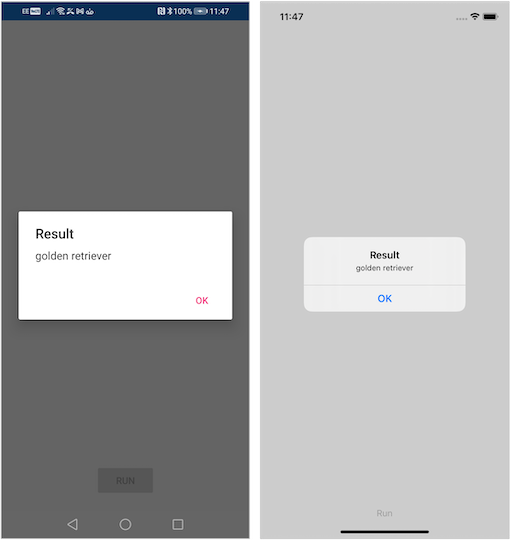

###### Sample: Machine learning in Xamarin with ONNX Runtime

## Overview
These first-principles examples demonstrate use of [ONNX Runtime](https://onnxruntime.ai/) for on-device inferencing in a Xamarin.Forms app.  

The intent is to provide a helpful on-ramp for those looking to leverage [ONNX Runtime](https://onnxruntime.ai/) in their Xamarin.Forms apps. Be sure to checkout the official [getting started](https://onnxruntime.ai/docs/get-started/with-csharp.html) and [tutorial](https://onnxruntime.ai/docs/tutorials/api-basics.html) content as well as the [Xamarin specific samples](https://github.com/microsoft/onnxruntime-inference-examples/tree/main/mobile/examples/Xamarin).

### [InferencingSample](InferencingSample)

Classifies the primary object in the [test image](https://github.com/microsoft/onnxruntime/raw/master/csharp/sample/Microsoft.ML.OnnxRuntime.ResNet50v2Sample/dog.jpeg), a golden retriever in this case, and displays the result.

An existing open-source image classification model ([MobileNet](https://github.com/onnx/models/blob/master/vision/classification/mobilenet)) from the [ONNX Model Zoo](https://github.com/onnx/models#onnx-model-zoo) has been used along with the [test image](https://github.com/microsoft/onnxruntime/raw/master/csharp/sample/Microsoft.ML.OnnxRuntime.ResNet50v2Sample/dog.jpeg) from an [existing sample](https://github.com/microsoft/onnxruntime/tree/master/csharp/sample/Microsoft.ML.OnnxRuntime.ResNet50v2Sample).

### [CustomVisionSample](CustomVisionSample)

Demonstrates use of an image classification model built with [Azure Custom Vision](https://azure.microsoft.com/services/cognitive-services/custom-vision-service). Similar to the original [InferencingSample](#inferencingsample), this classifies the primary object in the [test image](https://github.com/Azure-Samples/cognitive-services-onnx-customvision-sample/raw/master/SampleImages/Plankton/Mollusc/BE0612ST03_09_03801131_3093.bmp), a mollusc in this case, and displays the result.

The [PlanktonModel](https://github.com/Azure-Samples/cognitive-services-onnx-customvision-sample/raw/master/Assets/PlanktonModel.onnx) was borrowed from an [existing Windows ML sample](https://github.com/Azure-Samples/cognitive-services-onnx-customvision-sample). It had been trained with, and directly exported from, [Azure Custom Vision](https://azure.microsoft.com/services/cognitive-services/custom-vision-service).

You can create and test out your own model by following the steps in the [Windows ML ONNX Sample Read Me](https://github.com/Azure-Samples/cognitive-services-onnx-customvision-sample#adding-your-own-sample-model-of-your-own-classifier). This also provides details on the [model input](https://github.com/Azure-Samples/cognitive-services-onnx-customvision-sample#things-to-note). See [Quickstart: Build and image classifier with the Custom Vision web portal](https://docs.microsoft.com/azure/cognitive-services/custom-vision-service/getting-started-build-a-classifier).

## Getting Started

This sample should build and run from [Visual Studio](https://www.visualstudio.com) with no additional setup. You can clone (or download) the [mobcat-samples repo](https://github.com/xamcat/mobcat-samples) then open **InferenceSample.sln**

## Known Issues

### [MissingMethodException](https://docs.microsoft.com/dotnet/api/system.missingmethodexception) related to [ReadOnlySpan&lt;T>](https://docs.microsoft.com/dotnet/api/system.readonlyspan-1)

In [Visual Studio 2022](https://visualstudio.microsoft.com), [Hot Reload](https://docs.microsoft.com/xamarin/xamarin-forms/xaml/hot-reload) loads some additional dependencies including [System.Memory](https://www.nuget.org/packages/System.Memory) and [System.Buffers](https://www.nuget.org/packages/System.Buffers) which may cause conflicts with packages such as [ONNX Runtime](https://www.nuget.org/packages/Microsoft.ML.OnnxRuntime.Managed). The workaround is to [Disable Hot Reload](https://docs.microsoft.com/xamarin/xamarin-forms/xaml/hot-reload#enable-xaml-hot-reload-for-xamarinforms) until this [issue](https://developercommunity.visualstudio.com/t/bug-in-visual-studio-2022-xamarin-signalr-method-n/1528510#T-N1585809) has been addressed.