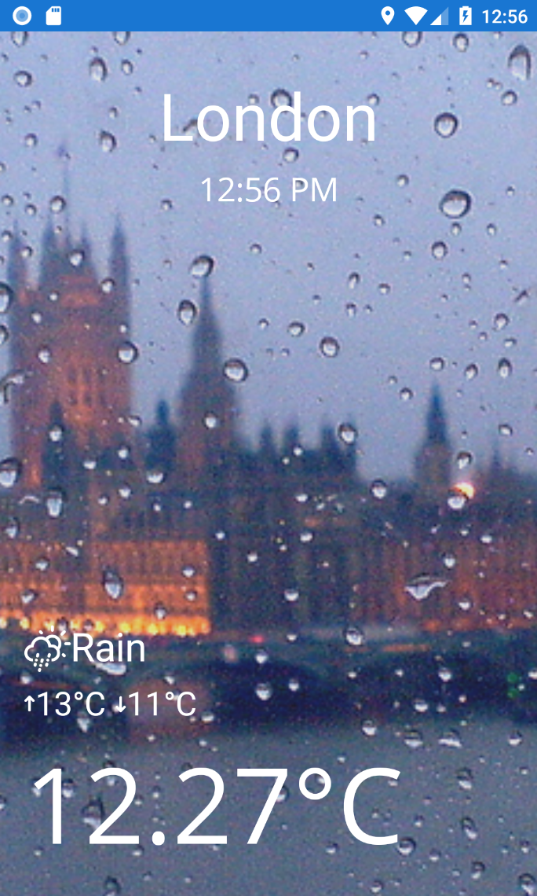
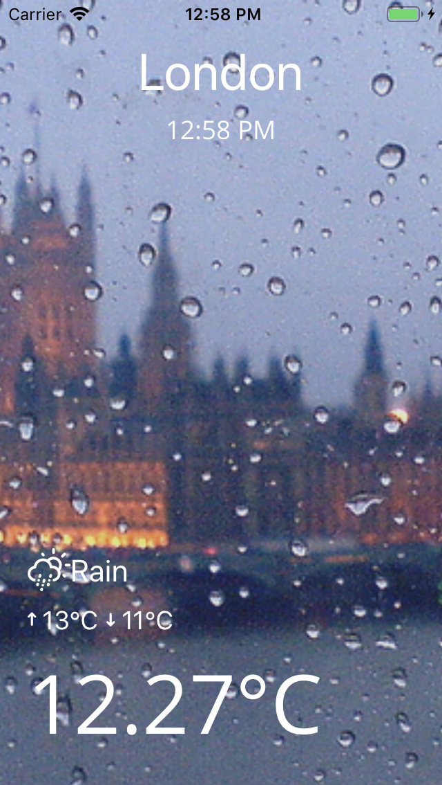

# WeatherTron 9000

## Overview
WeatherTron 9000 is a sample single view [Xamarin](https://docs.microsoft.com/en-us/xamarin) app demonstrating the use of the [MobCAT](../../mobcat_shared/MobCAT) and [MobCAT.Forms](../../mobcat_shared/MobCAT.Forms) components in support of recommended patterns and practices.

The sample mobile app (illustrated above) is built using [Xamarin.Forms](https://docs.microsoft.com/en-us/xamarin/xamarin-forms/) and leverages [Xamarin Essentials](https://docs.microsoft.com/en-us/xamarin/essentials/) features, such as [Geolocation](https://docs.microsoft.com/en-us/xamarin/essentials/geolocation?context=xamarin/xamarin-forms) and [Preferences](https://docs.microsoft.com/en-us/xamarin/essentials/preferences?context=xamarin/xamarin-forms).  

This is underpinned by a basic web service built with [asp.net core 2.1](https://blogs.msdn.microsoft.com/dotnet/2018/05/30/announcing-net-core-2-1/). You will need to host this service yourself in order to run the client sample.  

## Getting Started
The [client read me](xamarin/README.md) provides detailed steps on how to get the sample running. This will indicatively involve:  

1. Creating apps in the App Center Portal
2. Executing a script to provision the weather service
3. Setting environment variables representing the app secrets

### Prerequisites
The following dependencies are required in order to follow these steps:  

- [Azure CLI](https://docs.microsoft.com/en-us/cli/azure/install-azure-cli)
- [Microsoft Azure Subscription](https://azure.microsoft.com/en-gb/pricing/purchase-options/)
- [.NET Core 2.1 SDK](https://www.microsoft.com/net/download/dotnet-core/2.1)
- [OpenWeatherMap APP ID](https://openweathermap.org/appid)
- [Visual Studio](https://visualstudio.microsoft.com/vs)

## Acknowledgements

### Weather Icons
The custom weather icons are from https://erikflowers.github.io/weather-icons/